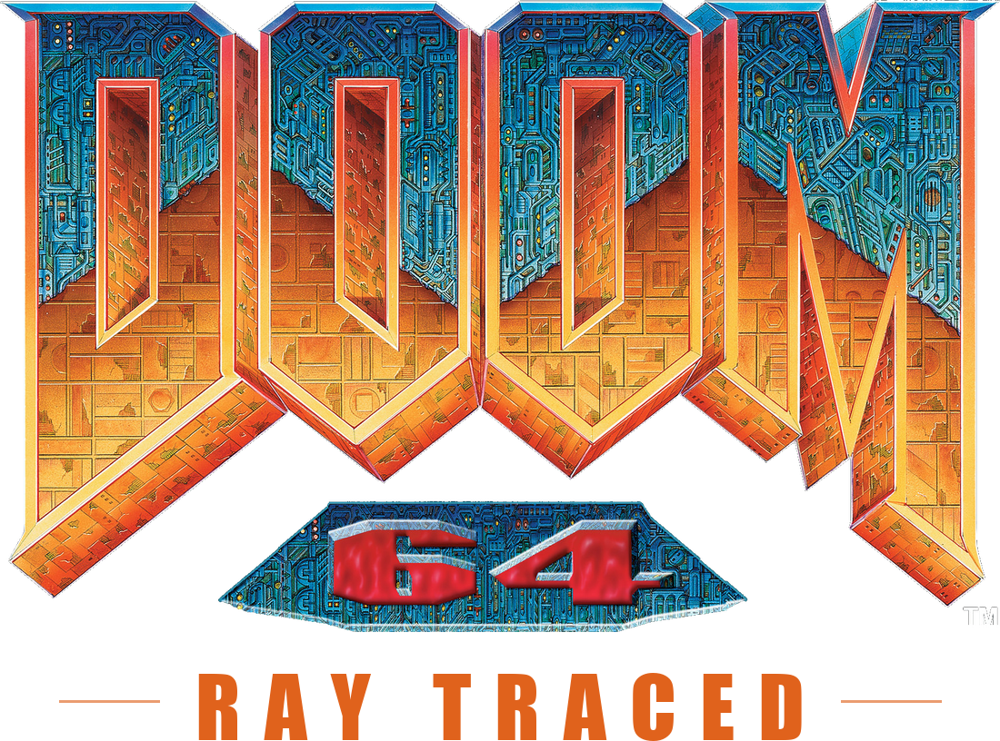
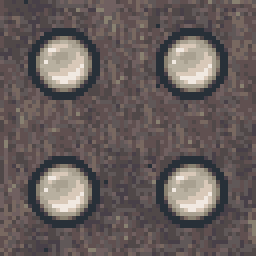
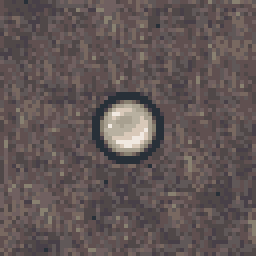

<div align="center">



<h3>Path-traced <em>Doom 64: Retribution</em></h3>

<p>
Real ray tracing on the N64 original — no rasterized fallback, no RTX Remix.<br>
Every light in the game is a real emitter, and every surface answers to it.
</p>

<p>


<br>


</p>

<p>
<a href="AI-DECLARATION.md"></a>
</p>

<sub>
Written by AI under human direction. The author is a .NET engineer, not a graphics
programmer:<br>the direction, the judgement of every rendered frame and every decision are
theirs — the code is Claude's. <a href="AI-DECLARATION.md">Details</a>.
</sub>

<sub><b><a href="AGENTS.md">AGENTS.md</a></b> &nbsp;·&nbsp; <a href="docs/doom64-retribution-pathtracing-plan.md">Path-tracing plan</a> &nbsp;·&nbsp; <a href="docs/material-authoring-spec.md">Material spec</a> &nbsp;·&nbsp; <a href="compat-patches.md">Compat patches</a> &nbsp;·&nbsp; <b><a href="CREDITS.md">Credits</a></b></sub>

</div>

---

## ⛧ &nbsp;Contents

- [**Features**](#features) — [lighting](#lighting) · [atmosphere](#atmosphere) · [materials](#materials) · [sprites, monsters, gore](#sprites) · [HUD and menus](#hud) · [denoising and upscaling](#denoising)
- [**Install and play**](#install) — download, extract, point it at your copy of Retribution
- [**Building it yourself**](#building) — [what you need](#requirements) · [dependencies](#dependencies) · [build](#build) · [first run](#first-run)
- [**Launchers**](#launchers) — how the game and the A/B arms are started
- [**For developers**](#developers) — the doc index, in [DEVELOPERS.md](DEVELOPERS.md)
- [**Art changes**](#art) — the one texture this project edits, and why
- [**Credits**](#credits) — RTGL1, gzdoom-rt, Retribution, Doom 64
- [**AI declaration**](AI-DECLARATION.md) — what was written by AI, and what wasn't

<br>

<a id="features"></a>
## ⛧ &nbsp;Features

The renderer is RTGL1's. What this project adds is everything above it: the game's fake
lighting replaced with real emitters, and a set of engine features Doom 64 never had.
Every one of them is documented — the doc is the reference, this is the index.

<a id="lighting"></a>
### Lighting — the main body of work

Doom 64 paints light. Sectors are set bright where a lamp *should* be, walls carry
baked-in glow, and shafts are drawn into the floor texture. Under path tracing that reads
as surfaces glowing for no reason, while the fixture beside them stays black. The bulk of
this project is finding those and replacing them with something that actually emits.

- **Painted light → real fixtures.** Nine repair families in one wad — sequence chains,
  blinks, ACS light calls (literal *and* computed args), painted shafts, painted tints,
  sector lamps, per-panel wall lamps. → [`docs/sequence-light-chains.md`](docs/sequence-light-chains.md)
- **Finding them.** `scan_light_specials.py`, `scan_fake_lightshafts.py`,
  `scan_painted_light.py` (1128 game-wide candidates, with a fixture-distance column), plus
  in-game `whatsthat`, `rt_tex_probe` and `rt_lightlevel_watch`.
  → [`docs/rt-lighting-practices.md`](docs/rt-lighting-practices.md)
- **Wall monitors.** 48 flicker lights across 8 maps, one per 64×64 tile, placed at the
  emissive mask's lit centroid rather than mid-tile. → [`AGENTS.md`](AGENTS.md)
- **Inferred fixtures** — ceiling insets, wall strips, hanging tech, solo bulbs, spin
  panels — derived from the texture rather than hand-placed.
  → [`docs/solo-bulb-lamps.md`](docs/solo-bulb-lamps.md), [`docs/faux-lamp-panels.md`](docs/faux-lamp-panels.md)
- **Flames.** All 84 torch/fire/candle sprites are lit engine-side, not by texture meta,
  because meta can express neither the offset up onto the flame nor a flicker.
  → [`docs/flame-lighting.md`](docs/flame-lighting.md)
- **World emissives** — lava, monitors, keys, EXIT signs, teleporters as masked emitters
  feeding GI. → [`docs/material-authoring-spec.md`](docs/material-authoring-spec.md)

<a id="atmosphere"></a>
### Atmosphere

| Feature | Notes | Doc |
|---|---|---|
| **The moon** | A disc in the sky plus a real directional light, aimed alike; the disc alone casts nothing, because the sky cubemap is not importance-sampled. Aim with the `moon` CCMD, per-map table in `RT_MOON_PRESETS`. Shadow rays must prove they reached sky (`rt_sun_require_sky`) or the moon washes sealed rooms. | [`moon-and-sky-leaks`](docs/moon-and-sky-leaks.md) |
| **Clouds + lightning** | A layered cloud deck (`rt_clouds_*`): 6–8 baked slices drawn as stacked sky-dome shells, so they parallax and occlude each other. It is sky *geometry*, not a participating medium — but moonlight is tinted and attenuated through the stack, and it flashes with MAP11's storm, whose schedule this puts back. `thunder` CCMD. | [`rt-clouds-and-lightning`](docs/rt-clouds-and-lightning.md) |
| **Per-map fog** | A froxel volume with a near/far ramp, tuned per level (`rt_fog_*`, `RT_FOG_PRESETS`, `fog` CCMD). Needed two RTGL1 froxel changes. | [`rt-fog`](docs/rt-fog.md) · [implementation](docs/rt-fog-implementation.md) |
| **Volumetric smoke** | Muzzle smoke as a real participating medium inside the fog's froxel volume, so it takes the colour of whatever lights the room. Six sources: weapons, monster guns, projectiles, barrels, flames. Sim is on the CPU, on purpose. `smoke` CCMD. | [`rt-smoke`](docs/rt-smoke.md) |
| **Water** | Stylized surface with projected caustics; flats are tagged engine-side, no per-map setup. | [`rt-water`](docs/rt-water.md) |
| **Lava** | The floor is the emitter — drifting quantized heat field (`rt_lava_flow*`), slow whole-surface breath, optional analytic light grid over the flats. | — |

<a id="materials"></a>
### Materials — *limited* PBR, on purpose

Doom 64's walls, floors and sprites were painted, not modelled. Nothing in them was ever
authored for a physically based renderer, so every surface starts out as a flat dielectric:
no metal anywhere, one roughness for the whole game. Since then **898 wall and flat
textures have been hand-classified**, plus **132 sprite codes covering 1,087 frames** —
metal, concrete, flesh, cloth, leather, wood, bone, rubber, lens — and baked into per-texel
roughness and metalness maps.

Then it is deliberately held back. Two dials decide how much of that authored material the
renderer is allowed to use, and **both ship at 0.35 rather than 1**:

| cvar | default | what it does |
|---|---|---|
| `rt_sprite_pbr_mix` | `0.35` | how much of a sprite's material is applied, 0..1 |
| `rt_tex_pbr_mix` | `0.35` | the same for walls and flats |
| `rt_sprite_pbr` | `1` | hard off switch for the whole sprite material pass |

At 0 the surface is the plain dielectric it was before any of this existed — not an
approximation of the old look, but exactly it.

**Why hold it back at all.** Three reasons, in the order they were found:

1. **Sprites are flat, and full PBR makes that obvious.** A sprite is one quad carrying one
   normal, so its indirect specular reflection vector is *identical for every texel* — the
   whole body samples the room in a single direction and takes one colour from it. A warm
   wall off to the side turns a soldier beige. Walls never do this; their normal maps vary
   the reflection per texel. This is a property of billboards, not a bug to fix, so the
   answer is to use less of the effect rather than more of it.
2. **The art is dithered.** Doom 64 fakes gradients by alternating two colours pixel by
   pixel. Classified independently, those two colours can end up with different materials,
   and the sprite renders as a checkerboard mosaic. The baker now averages the material
   channels to kill that, but a lower mix makes what remains matter less.
3. **Noise.** Every glossy surface is another specular lobe the path tracer has to resolve
   and the denoiser has to clean up. This project would rather have slightly less precise
   lighting than visible boiling — so the mix is also a noise dial.

The result is a game that reacts to light like Doom 64 with *materials*, rather than one
pretending to be a modern shooter. If you want the full authored set, raise both mixes to
1; if you want none of it, `rt_sprite_pbr 0` and `rt_tex_pbr_mix 0`.

→ [`docs/plan-sprite-materials.md`](docs/plan-sprite-materials.md) for the labelling
tools, the export format and the bakers.

<a id="sprites"></a>
### Sprites, monsters, gore

- **Enemy eyes** — brightmap-only emissive masks. They glow; they never lantern the room
  (no `lightIntensity`, and never `noShadow`, which kills the monster's shadow).
- **Lost Souls** — the light rides on the fire frames themselves, A–F only, so a corpse
  does not light the room.
- **Persistent blood** — splats stay on the floor (`rt_gore_*`), explosive kills leave
  blood at all, and per-monster blood colour finally renders: RTGL1 keys materials by
  name, so every palette translation of a sprite uploaded as the same material and the
  first one drawn won. → [`docs/blood-persist.md`](docs/blood-persist.md)
- **Spectres** — rasterized translucent overlay with an alpha floor, rather than forced
  water/glass. → [`docs/spectre-issue-log.md`](docs/spectre-issue-log.md)

<a id="hud"></a>
### HUD, menus, presentation

- **The Doom guy mugshot** — Doom 64 dropped the status bar, so Retribution has no face.
  All 42 frames are *generated* from one painted sheet and restyled to the D64 palette;
  nothing in `d64r-mugshot.pk3` is hand-authored. → [`docs/hud-mugshot.md`](docs/hud-mugshot.md)
- **Flashlight** — dim warm beam tipped toward the ground with a battery cycle and a HUD
  meter (`rt_flsh*`, **F** by default). The beam angle and pitch are tuned to catch muzzle
  smoke, not free parameters.
- **Act title cards** and title/logo art. → [`docs/act-title-cards.md`](docs/act-title-cards.md)
- **Menu patches** in Retribution's own font — `rt/wad` loads *last*, after every `-file`
  PWAD, so RT's plain-Doom menu art was overriding the D64 art.
  → [`compat-patches.md`](compat-patches.md)

<a id="denoising"></a>
### Denoising and upscaling

**The A-SVGF denoiser is the shipping path, with DLSS 2 or FSR 2 for upscaling.**

The development launcher pins DLSS (`rt_upscale_dlss 2`) because that is what this
machine has. **The release launcher will not force it** — DLSS is NVIDIA-only, and on
anything else the upscaler has to be FSR 2 (`rt_upscale_fsr2`) or none at all. Note the
two share one upscaler slot and FSR is applied second, so a stale `rt_upscale_fsr2` in
your ini silently disables DLSS; set one, not both.

> [!WARNING]
> **DLSS Ray Reconstruction is alpha here and does not render well — it ships OFF and is
> not recommended.** It is wired up and can be switched on for experiments, but the image
> is not stable enough to play with. A-SVGF is the intended path; treat anything in
> [`RAYRECONSTRUCTION.md`](RAYRECONSTRUCTION.md) and `docs/rayreconstruction/` as an
> experiment log rather than a recommendation.

Also keep `rt_normalmap_stren` / `rt_heightmap_stren` near **1** — 10+ destabilises the
denoiser regardless of which one you use.

<br>


<a id="install"></a>
## ⛧ &nbsp;Install and play

> [!NOTE]
> **v0.1.0 is a pre-release.** It builds and runs here, but nobody outside this
> machine has played it: the FSR path has never run on AMD hardware, and DLSS Ray
> Reconstruction is alpha and ships off. Bug reports welcome.

You need a GPU with hardware ray tracing (NVIDIA RTX, AMD RDNA 2+, Intel Arc) and
a DOOM II you own. Everything else is free.

**1. Download and extract this**

[**Releases**](https://github.com/jlrouzies-fr/doom64-rt/releases) → `Doom64-RT.zip` (~110 MB).
Extract it anywhere — it needs no installer and writes nothing outside its own folder.

**2. Get Doom 64: Retribution and its music, and extract both into `game\`**

| Download | |
|---|---|
| [Doom 64: Retribution v1.5](https://www.moddb.com/mods/doom-64-retribution) | Extract the **whole** download into `game\`, not just the WAD — the brightmaps, the soundfont and the fluidsynth DLLs are all used. |
| [OGG music pack v1.3](https://www.moddb.com/mods/doom-64-retribution/addons/doom-64-retribution-ogg-music-pack-v13) | `D64MUS.ZIP` on the same page. Unzip it into `game\` too. |

**3. Have DOOM II installed**

Steam or GOG — the launcher finds either by itself, so usually there is nothing to
do here. If your `doom2.wad` lives somewhere unusual, the startup check has a
Browse button. [Freedoom Phase 2](https://freedoom.github.io/) works as a free
stand-in, untested here.

**4. Run `launch-doom64-rt.cmd`**

It checks everything first and tells you what is missing, with a link to each
download. Green ticks all the way down, then **RIP AND TEAR**.

<br>

<a id="building"></a>
## ⛧ &nbsp;Building it yourself

*For working on the project. To just play it, use the [release](#install) — it is the same
thing, already built.*

> [!IMPORTANT]
> Almost nothing needed to *run* the game is in git — engine build, RTGL1 build, SDKs,
> the Python venv, the `sourcecode/gzdoom-rt` checkout, IWAD, Retribution and music are all
> gitignored. What is tracked is our RT materials, our tools, our engine patches and the docs.

<a id="requirements"></a>
### What you need

| | |
|---|---|
| **GPU** | Any GPU with **Vulkan ray tracing** — NVIDIA RTX, AMD RDNA 2 and later, Intel Arc. Path tracing only; there is no rasterized fallback, so hardware RT is not optional. Upscaling is DLSS 2 **or** FSR 2 (`rt_upscale_dlss` / `rt_upscale_fsr2`); DLSS is NVIDIA-only, FSR runs anywhere. Only NVIDIA has been tested here. |
| **OS** | Windows — the build scripts and the win32 surface path. |
| **Toolchain** | Visual Studio **Build Tools 18** with the x64 native toolset, CMake, Python 3.13 with Pillow. The build scripts call `VsDevCmd.bat` from the `…\Microsoft Visual Studio\18\BuildTools\…` path — another edition or version means editing line 3 of both. |
| **IWAD** | A `doom2.wad` **you own** — Retribution is a PWAD and cannot run without one. The Steam or GOG release of DOOM II both work; the launcher looks in the usual install locations and otherwise takes `D64RT_IWAD`. |
| **Stock engine package** | A **gzdoom-rt 1.0.2 release** unpacked to `gzdoom-rt-1.0.2\`. Not optional: `build-gzdoom-rt.cmd` stages `rt\`, `libsndfile-1.dll` and `openal32.dll` out of it, and without that `rt\` tree the engine has no shaders, no `rt\data` and no `rt\wad`. |

### Game files — download these yourself

None of this is redistributed here. Get it from the mod's own ModDB page and drop it in
`Doom64-Retribution\`:

| Download | What to do with it |
|---|---|
| **Doom 64: Retribution v1.5** — [moddb.com/mods/doom-64-retribution](https://www.moddb.com/mods/doom-64-retribution) | **Extract the whole thing**, not just the WAD. It carries `D64RTR[v1.5].WAD`, `D64RTR_BRIGHTMAPS.PK3`, `DOOMSND.SF2` and the two `libfluidsynth` DLLs — all of them are used, and picking files out one at a time is how you end up missing one. |
| **OGG music pack v1.3** — [the addon page](https://www.moddb.com/mods/doom-64-retribution/addons/doom-64-retribution-ogg-music-pack-v13) | Unzip `D64MUS.ZIP` in the same place. Not every track is in it, which is why the soundfont above still matters: without it the MIDI ones fail with `Unable to load : Unable to read header` (the title screen and MAP00 show this). |

> [!NOTE]
> The ModDB download is named **`D64RTR[v1.5].WAD`**. This repo also carries a shell-safe
> `D64RTR_v15.WAD` copy, and the launcher accepts either — those square brackets are a
> wildcard to PowerShell's `Test-Path`, so a naive check reports the file missing while it
> is sitting right there.

The launcher loads the OGG pack rather than the MIDI + `DOOMSND.SF2` route, so the music
pack is required, not optional — `launch-retribution-rt.cmd` passes it on every start.
Retribution's own `D64RTR_INSTRUCTIONS.TXT` §"Music" covers the soundfont alternative if
you would rather have the MIDIs.

### The IWAD

DOOM II is still sold, so this project does not point anyone at a pirated IWAD. Buy it on
Steam or GOG — or use the free [Freedoom](https://freedoom.github.io/) Phase 2 IWAD if you
want a no-purchase route, though nothing here has been tested against it.

The launcher searches the usual Steam and GOG install paths, plus `doom2.wad` beside the
repo. If yours lives elsewhere, point at it rather than editing the script:

```powershell
$env:D64RT_IWAD = "C:\Path\To\doom2.wad"
```

Everything else — engine, deps, mod files, tools — now resolves relative to the repo, so
the clone can live anywhere.

<a id="dependencies"></a>
### Dependencies — all under `deps\`, never Program Files

> [!IMPORTANT]
> The engine and the path tracer must be **this project's forks, on the `doom64-rt`
> branch** — not their upstreams. Both carry changes this repo depends on (the RT feature
> file split, the froxel changes fog and smoke need, the emissive and translation fixes).
> Upstream will build, then behave wrong in ways nothing reports.
> **The project repo itself is on `fileSplit`** — its `main` branch is an empty initial
> commit, so a plain `git clone` gets you a README and nothing else.

```powershell
git clone -b fileSplit https://github.com/jlrouzies-fr/doom64-rt.git Doom64-RT
cd Doom64-RT
git clone --recurse-submodules -b doom64-rt https://github.com/jlrouzies-fr/gzdoom-rt.git sourcecode\gzdoom-rt
git clone --recurse-submodules -b doom64-rt https://github.com/jlrouzies-fr/RTGL.git      deps\RTGL
git clone https://github.com/NVIDIA/DLSS.git                                              deps\DLSS   # NVIDIA only
```

> [!CAUTION]
> **`--recurse-submodules` is not optional.** The engine keeps `unordered_dense` as a
> submodule under `src\common\rendering\rt\`, and RTGL1 keeps six (imgui, glfw, cgltf,
> glaze, glm, DirectX-Headers). Without them the engine compiles for several minutes and
> then fails every RT translation unit at once with
> `Cannot open include file: 'unordered_dense/…'`. If you already cloned flat:
> `git -C sourcecode\gzdoom-rt submodule update --init --recursive` (and the same for
> `deps\RTGL`).

Only the DLSS SDK comes from its own upstream — it supplies the NGX snippets, and
`build-rtgl.cmd` currently requires it. On non-NVIDIA hardware that dependency has to come
out of the build (`-DRG_WITH_NATIVE_DLSS=OFF`) and upscaling falls back to FSR2.

<a id="build"></a>
### Build

```powershell
.\tools\build-gzdoom-rt.cmd     # vcpkg + ZMusic + gzdoom-rt  -> build\RelWithDebInfo\gzdoom.exe
.\tools\build-rtgl.cmd          # shaders + RTGL1.dll         -> build\RelWithDebInfo\rt\bin\
```

Both scripts stage their output into `sourcecode\gzdoom-rt\build\RelWithDebInfo\`, so run
the engine build first. Three things they do deliberately, each one paid for:

- **`build-rtgl.cmd` aborts if a shader fails.** `GenerateShaders.py` exits 0 even when
  `glslangValidator` rejects a shader, which would otherwise ship the *previous* SPIR-V into
  a playtest.
- **It clears the object files when `ShaderCommonC.h` changes.** The generated uniform
  struct is not a tracked CMake dependency, so a stale `.obj` keeps the old
  `sizeof(ShGlobalUniform)` and every field past the old size silently reads **zero** — no
  crash, no validation error. That cost a full day once.
- **It checks the copy of `RTGL1.dll` succeeded.** The DLL is locked while gzdoom is
  running, and a silent failure means fresh shaders get tested against the old renderer.
  Kill `gzdoom.exe` before building.

<a id="first-run"></a>
### First run

There is no first-run ritual any more — `build-gzdoom-rt.cmd` does it. Just play:

```powershell
.\tools\launch-retribution-rt.cmd          # MAP01
.\tools\launch-retribution-rt.cmd 13       # any map, 1-34
.\tools\launch-retribution-rt.cmd menu     # boot to the title screen
```

For the record, these are the three things the build script now does for you at the end of
staging, each of which fails *silently* when skipped, and each of which has to be redone
after any clean rebuild because the stock `rt\` tree is restaged wholesale:

| Step | Why it matters |
|---|---|
| writes `rt\RTGL1.json` with `developerMode: true` | RTGL1 only ever **reads** this file (`VulkanDevice_Init.cpp:228`, `.value_or(default)`). No file means `developerMode: false`, every authored PNG material ignored, KTX2 only — and nothing warns you. The game just looks stock. |
| stages `Retribution-RT-Materials\rt\` into the engine `rt\` | The materials themselves. |
| copies `rt-wad-overlay\` into `rt\wad` | `rt\wad` is appended **after** every `-file` PWAD, so without it the stock RT menu art overrides Retribution's. |

None of that needs Python. The interpreter is only for the authoring tools —
generators, scanners, gallery builders — and for RTGL1's own shader generation when you
build it.

<br>

<a id="launchers"></a>
## ⛧ &nbsp;Launchers

*Also the developer path — these run the game out of a source checkout, not out of the release.*

<table>
<tr><th align="left">Command</th><th align="left">What you get</th></tr>
<tr>
  <td><code>tools\launch-retribution-rt.cmd [1-34|menu]</code></td>
  <td>The game. Native RTGL1 path tracing, A-SVGF denoiser, DLSS or FSR upscaling.</td>
</tr>
<tr>
  <td><code>tools\ab.cmd &lt;arm&gt; [map]</code></td>
  <td>A/B runner. Arms are config files in <code>tools\arms\*.cfg</code>, never console commands.</td>
</tr>
<tr>
  <td><code>tools\launch-enemy-gallery-rt.cmd</code></td>
  <td>MAP98 — enemy eye / emissive debug hall.</td>
</tr>
<tr>
  <td><code>tools\launch-texture-gallery-rt.cmd</code></td>
  <td>MAP99 — texture PBR gallery.</td>
</tr>
</table>

> [!NOTE]
> The launcher pins ~390 cvars via `+exec tools\d64rt-pins.cfg` rather than on the command line.
> That is deliberate: `cmd.exe` truncates at 8191 characters, and the old inline form silently
> dropped the tail — arms ran on defaults while the tool printed values it never applied.

<br>

<a id="developers"></a>
## ⛧ &nbsp;For developers

Everything in this project is written down — each feature, each fix, and each dead end,
usually written the day it cost us something.

### → &nbsp;**[DEVELOPERS.md](DEVELOPERS.md)** — the index of every doc in the repo

Grouped by feature docs, the lighting-repair pipeline, materials and models, tooling,
generated inventories, and the historical briefs kept for *why* rather than *how*.

Three that matter more than the rest:

| | |
|---|---|
| [`AGENTS.md`](AGENTS.md) | The working handbook — diagnostic procedure for a wrongly-lit surface, the `rt/` source map, how to add a cvar, and 31 numbered pitfalls not to repeat. |
| [`compat-patches.md`](compat-patches.md) | Every engine and RTGL1 change we made, dated, with the reason. |
| [`docs/open-issues-rt-lighting.md`](docs/open-issues-rt-lighting.md) | What still fails. |

<br>

---

<a id="art"></a>
## ⛧ &nbsp;Art changes

This project changes lighting, not artwork — with one exception, and it is here so it
is not a quiet one. It **ships enabled**: `d64r-sflatas-broken.wad` is in the launcher's
own file list, so this is what the game looks like out of the box.

### SFLATAS — the ceiling lamp pane

<table>
<tr>
  <th align="center">Before</th>
  <th align="center">After</th>
</tr>
<tr>
  <td align="center"></td>
  <td align="center"></td>
</tr>
<tr>
  <td align="center"><sub>2×2 working bulbs per 64-unit tile — four lights</sub></td>
  <td align="center"><sub>three smashed, one still burning — one light, nothing moved</sub></td>
</tr>
</table>

The glass is repainted; **no bulb is moved**. That is the whole trick, and §"Why this
edit and not another" below is why it matters.

**Why.** A grating only casts a legible shadow when its light comes from one compact
source. Measured in the shadow lab (`tools/build_shadow_lab.py`, the same fixture alone
in a dark room):

| lights on the pane | result |
|---|---|
| 1 | crisp diamond shadows on floor, walls and ceiling |
| 4 | shadows, once the intensity beats the bounce fill |
| 16 | nothing, at any source radius |

The lamp pane places one light per painted bulb, and Doom 64 paints those bulbs 32 map
units apart — **one metre**. The cage grating's openings are about half that. Once the
lights are further apart than the occluder's features, each one lays down an offset copy
of the mesh shadow that fills in the previous one's gaps, and the pattern cancels. That
is not a renderer bug: a real ceiling of metre-spaced bulbs behind a half-metre mesh
washes out too. It is why the caged zombie on MAP01 stood in a shadowless glow.

**Why this edit and not another.** The obvious version — repaint the pane as a single
bulb in the middle of the tile — was built first, and it is worse. Moving painted
geometry means moving it in the albedo *and* in the normal, height and roughness maps;
then the light has to follow it; then every pane needs a per-sector texture offset so a
wall does not slice the one bulb that is left, and the light has to follow that too.
Breaking three bulbs changes **nothing's position**. All four housings still exist, so
the authored relief maps are still correct and are left alone, and the flat keeps its
original tiling, so no sector needs an offset. It also reads as a place rather than as a
texture edit: this is an overrun military installation, and the maintenance stopped.

**How it was made.** `tools/gen_broken_bulb_flat.py`. The albedo is hand-painted; the
tool works out which bulb is still intact by measuring luminance in the authored bulb
windows (157 against 53/64/94 — not a judgement call), keeps that one blob in the `_e`
emissive mask and clears the other three, and restores the authored `_n`/`_h`/`_orm`. The
engine's `SoloBulbTextures` then puts one light on the survivor — at world **(16, 16)**
for a bulb the image draws at (16, 48), because a ceiling flat's world Y is `64 − imageY`.

<br>

---

<a id="credits"></a>
## ⛧ &nbsp;Credits

This project renders someone else's game, in someone else's engine, with someone else's
path tracer. **[CREDITS.md](CREDITS.md) is the full list** — this is the short one.

<table>
<tr><th align="left">Project</th><th align="left">By</th></tr>
<tr>
  <td><b>RTGL1</b> / RayTracedGL1 — the path tracer<br><sub>MIT</sub></td>
  <td><b>Sultim Tsyrendashiev</b> (© 2020–2023) and <b>Vasilii Shirokii</b> (© 2024).
      Sultim is also the author of <i>Doom: Ray Traced</i>, which this project's material
      and lighting conventions follow.</td>
</tr>
<tr>
  <td><b>GZDoom: Ray Traced</b> — the engine we build<br><sub>GPLv3</sub></td>
  <td><b>Vasilii Shirokii</b> (<a href="https://github.com/vs-shirokii/gzdoom-rt">vs-shirokii</a>) —
      the RT renderer our engine work extends is his.</td>
</tr>
<tr>
  <td><b>GZDoom</b><br><sub>GPLv3</sub></td>
  <td>The <b>ZDoom</b> / <b>GZDoom</b> teams — <b>Christoph Oelckers</b>,
      <b>Magnus Norddahl</b>, <b>Randy Heit</b>, <b>Alexey Lysiuk</b>,
      <b>Rachael Alexanderson</b>, <b>Braden Obrzut</b> and many contributors.
      Doom source © 1997 <b>id Software</b> and <b>Raven Software</b>.</td>
</tr>
<tr>
  <td><b>Doom 64: Retribution v1.5</b> — the game</td>
  <td><b>Nevander</b>, plus the long list of authors in Retribution's own credits —
      <b>Kaiser</b> (Doom 64 EX, WadGen, Absolution TC), <b>Elbryan42</b>,
      <b>AgentSpork</b>, <b>Steven Searle</b>, <b>Dreadflame</b>, <b>Footman</b>,
      <b>Cage</b>, <b>Almonds</b>, <b>NMN</b> and others.</td>
</tr>
<tr>
  <td><b>Doom 64</b> (1997) — the original</td>
  <td><b>Midway Games</b> and <b>id Software</b>. Music and sound by <b>Aubrey Hodges</b>.</td>
</tr>
<tr>
  <td><b>DLSS 2</b> / Ray Reconstruction</td>
  <td><b>NVIDIA</b>.</td>
</tr>
</table>

<br>

---

<div align="center">
<sub>
Built on <a href="https://github.com/vs-shirokii/gzdoom-rt">gzdoom-rt</a> and
<a href="https://github.com/sultim-t/RayTracedGL1">RTGL1</a> over
<b>Doom 64: Retribution</b> — see <a href="CREDITS.md">CREDITS.md</a>.<br>
<i>Doom</i> and <i>Doom 64</i> are trademarks of id Software. This is a non-commercial fan project,
not affiliated with id Software, Bethesda, Midway or NVIDIA.
</sub>

<br>

<sub>
🤫 &nbsp;<i>Don't tell Alex it's vibe coded.</i><br>
<sub>…it's declared right there at the top, actually. Every light still had to survive a human looking at it.</sub>
</sub>
</div>
