<div align="center">


<h3>Path-traced <em>Doom 64: Retribution (WIP)</em></h3>

<p>
Real ray tracing on the N64 original — no rasterized fallback, no RTX Remix.<br>
Every light in the game is a real emitter, and every surface answers to it.
</p>

<p>


<br>


</p>

<p>
<a href="AI-DECLARATION.md"></a>
</p>

</div>

---

## ⛧ &nbsp;Contents

- [**Features**](#features) — one table: lighting, atmosphere, materials, sprites/gore, impacts, HUD, denoising
- [**Preview**](#preview) — in-engine captures
- [**Known issues**](#known-issues) — what is still wrong, before you play
- [**Install and play**](#install) — download, extract, point it at your copy of Doom 2
- [**Building it yourself**](#building) — [what you need](#requirements) · [dependencies](#dependencies) · [build](#build) · [first run](#first-run)
- [**Launchers**](#launchers) — how the game and the A/B arms are started
- [**For developers**](#developers) — the doc index, in [DEVELOPERS.md](DEVELOPERS.md)
- [**Art changes**](#art) — the textures this project redraws, and the one optional add-on
- [**Credits**](#credits) — RTGL1, gzdoom-rt, Retribution, Doom 64
- [**AI declaration**](AI-DECLARATION.md) — what was written by AI, and what wasn't

<br>

<a id="features"></a>
## ⛧ &nbsp;Features

The renderer is RTGL1's. What this project adds is everything above it: the game's fake
lighting replaced with real emitters, and a set of engine features Doom 64 never had.
Every one of them is documented in full elsewhere — this table is the index, not the doc.

<a id="lighting"></a><a id="atmosphere"></a><a id="materials"></a><a id="sprites"></a><a id="impacts"></a><a id="hud"></a><a id="denoising"></a>

| Category | Feature | Summary | Doc |
|---|---|---|---|
| **Lighting** | Painted light → real fixtures | Nine repair families across the wad — sequence chains, blinks, ACS light calls, painted shafts/tints, sector lamps, panel lamps — replacing baked-in fake glow with real emitters. | [`sequence-light-chains`](docs/sequence-light-chains.md) |
| | Wall monitors | 48 flicker lights across 8 maps, placed at the emissive mask's lit centroid. | [`AGENTS.md`](AGENTS.md) |
| | Inferred fixtures | Ceiling insets, wall strips, hanging tech, solo bulbs, spin panels — derived from the texture, not hand-placed. | [`solo-bulb-lamps`](docs/solo-bulb-lamps.md) · [`faux-lamp-panels`](docs/faux-lamp-panels.md) |
| | Flame lighting | All 84 torch/fire/candle sprites lit engine-side (offset onto the flame, flicker) rather than by texture meta. | [`flame-lighting`](docs/flame-lighting.md) |
| | World emissives | Lava, monitors, keys, EXIT signs, teleporters as masked emitters feeding GI. | [`material-authoring-spec`](docs/material-authoring-spec.md) |
| **Atmosphere** | The moon | Sky disc + real directional light, aimed alike; shadow rays must prove they reached sky (`rt_sun_require_sky`) or it washes sealed rooms. `moon` CCMD. | [`moon-and-sky-leaks`](docs/moon-and-sky-leaks.md) |
| | Clouds & Lightning | (`rt_clouds_*`); tints and attenuates moonlight, flashes with MAP11's storm. `thunder` CCMD. | [`rt-clouds-and-lightning`](docs/rt-clouds-and-lightning.md) |
| | Volumetric clouds | Raymarched cloud volume in the sky cubemap itself, not a painted shell — real interior density/self-shadowing that lights the level through GI for free (`rt_vclouds_*`). | [`plan-volumetric-clouds`](docs/plan-volumetric-clouds.md) |
| | Fire sky | Alternative sky for the five hell maps: dark backdrop, cloud deck, falling meteors, coloured lightning strikes aimed at the player (`rt_fireskies_new`, `rt_firesky_*`). | [`plan-fire-skies`](docs/plan-fire-skies.md) |
| | Per-map fog | Froxel volume, near/far ramp tuned per level (`rt_fog_*`, `fog` CCMD). | [`rt-fog`](docs/rt-fog.md) · [implementation](docs/rt-fog-implementation.md) |
| | Volumetric smoke | Muzzle/impact smoke as a participating medium inside the fog froxel, colour-lit by the room. Six sources; CPU sim. `smoke` CCMD. | [`rt-smoke`](docs/rt-smoke.md) |
| | Light shafts from lamps | Ordinary ceiling lamps, bulb lattices and solo bulbs cast shafts too, not just the sun (`rt_volume_shafts`). | [`plan-light-shafts`](docs/plan-light-shafts.md) |
| | Dust motes | Hashed-grid quads lit only where a shaft reaches (`rt_dust_*`). | — |
| | Water | Stylized surface with projected caustics, tagged engine-side. | [`rt-water`](docs/rt-water.md) |
| | Lava | Drifting quantized heat field as the emitter, slow whole-surface breath (`rt_lava_flow*`). | — |
| | Poison bubbles | Bubbles swell out of the nukage, burst into a ring of droplets and throw a little green while they do. Sliced from one painted sheet into six frames; colour matched to the *rendered* pool, since the flat's own albedo is nearly black. They keep off a bridge deck standing over the poison, and switch off under **Options › Effects**. A row of `d64_poison_*` knobs (rate, distance, size, height, saturation) and a lab map to tune them in. | [`poison-bubbles`](docs/poison-bubbles.md) |
| **Materials** | Limited PBR, on purpose | 898 wall/flat textures + 132 sprite codes (1,087 frames) hand-classified into roughness/metalness — but both mix dials ship at **0.35**, not 1, because full PBR breaks flat-normal sprites, exposes dithered art, and adds noise. `rt_sprite_pbr_mix`, `rt_tex_pbr_mix`. | [`plan-sprite-materials`](docs/plan-sprite-materials.md) |
| **Sprites & gore** | Enemy eyes | Brightmap-only emissive masks — glow without lighting the room or killing the shadow. | — |
| | Lost Souls | Light rides the fire frames (A–F) only, so a corpse stays dark. | — |
| | Persistent blood | Splats stay on the floor, explosive kills bleed, per-monster blood colour renders correctly (`rt_gore_*`). | [`blood-persist`](docs/blood-persist.md) |
| | Spectres | Rasterized translucent overlay with an alpha floor, not forced water/glass. | [`spectre-issue-log`](docs/spectre-issue-log.md) |
| **Impacts & destruction** | Sparks and debris | `P_LineAttack` hook with true surface normal + hit texture; metal sparks, concrete chips, flesh neither, chips bounce and settle (`rt_spark_*`). | [`rt-impact-fx`](docs/rt-impact-fx.md) |
| | Projectile impacts | Plasma, arachnotron bolt and BFG leave a branching electric mark with its own light and colour ramp (`rt_arc_*`). | [`plan-projectile-impact-fx`](docs/plan-projectile-impact-fx.md) |
| | Unmaker wall burns | Its laser leaves a hot spot, glow and short arc where it lands (`rt_laser_*`). | — |
| | Exploding barrels | Comes apart into curved plates that fly, tumble, settle and scorch the floor (`rt_barrel_*`). | — |
| **HUD & presentation** | Mugshot | All 42 frames generated from one painted sheet, restyled to the D64 palette. | [`hud-mugshot`](docs/hud-mugshot.md) |
| | Flashlight | Warm beam, battery cycle, HUD meter, angled to catch muzzle smoke (`rt_flsh*`, **F**). | — |
| | Act title cards | Title/logo art per act. | [`act-title-cards`](docs/act-title-cards.md) |
| | Menu patches | Retribution's own font; `rt/wad` loads last so it doesn't override D64 art. | [`compat-patches`](docs/compat-patches.md) |
| **Denoising & upscaling** | A-SVGF + DLSS 2 / FSR 2 | A-SVGF is the shipping denoiser; upscale with DLSS 2 (NVIDIA) or FSR 2 (anywhere) — they share one slot, set only one. Keep `rt_normalmap_stren`/`rt_heightmap_stren` near 1. | — |
| | NRD (ReLAX) | **Experimental, off by default** — an alternative denoiser lane behind `rt_nrd 1` (console only, does not persist). Same downstream frame shape as A-SVGF, but a bit noisier at the default 1 sample/pixel; raise **Options → Quality → Direct/Indirect samples per pixel to 2** and it closes the gap. | [`plan-nrd-denoiser`](docs/plan-nrd-denoiser.md) |
| | DLSS Ray Reconstruction | **Alpha, ships OFF, not recommended** — wired up for experiments but not stable enough to play with. The reason is upstream of RR itself: it expects a signal close to its training distribution, which means full BRDF/light **MIS** and real **area-light transport** — this renderer has neither. Without them RR only looks decent when brute-forced: samples per pixel and ReSTIR light candidates raised well above the shipping defaults, which costs more than it buys at 1 spp. A-SVGF is the intended path. | [`RAYRECONSTRUCTION.md`](RAYRECONSTRUCTION.md) · [`plan-area-lights-mis`](docs/plan-area-lights-mis.md) |
| | Shadow contact hardening | **Not implemented — the one place RR visibly beats A-SVGF.** A real shadow is sharp where the blocker touches the floor and softens with distance; A-SVGF draws it uniformly soft everywhere. The blocker distance is never recovered from the shadow ray, so nothing downstream can know the difference, and at the default `rt_shadow_samples 1` the penumbra is not in the signal at all — every bit of softness on screen is filter blur. RR reconstructs it from a learned prior. | [`plan-shadow-contact-hardening`](docs/plan-shadow-contact-hardening.md) |

<br>

<a id="preview"></a>
## ⛧ &nbsp;Preview

In-engine captures, uncropped, no post-processing beyond what the game itself does.

<table>
<tr>
  <td align="center">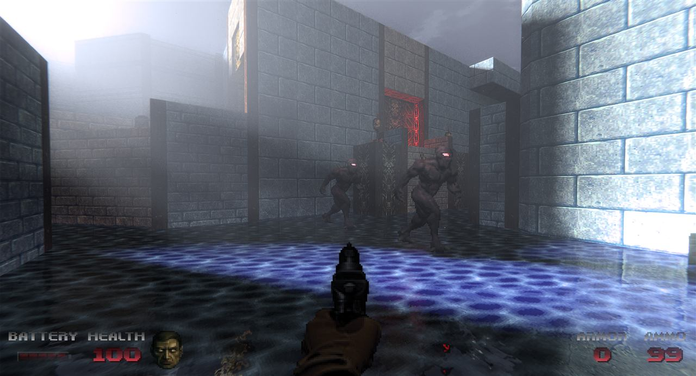<br><sub>Volumetric fog over water</sub></td>
  <td align="center">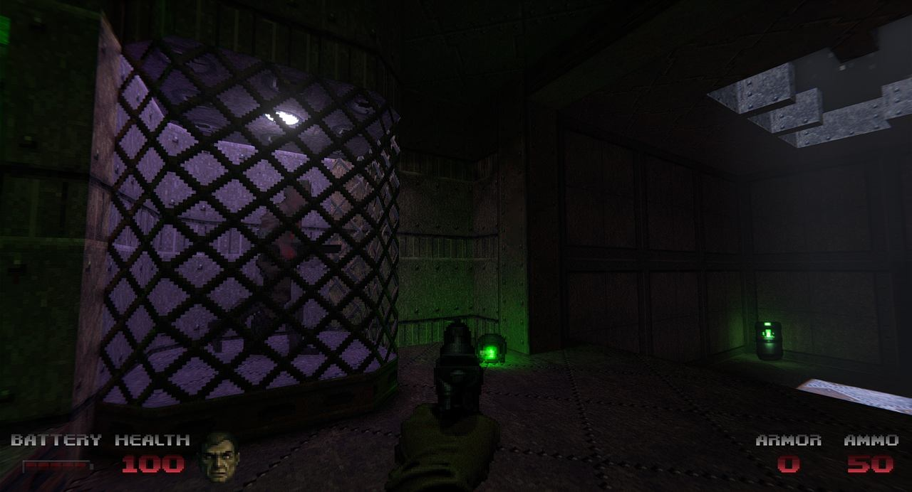<br><sub>Caged captive, colour bleed</sub></td>
  <td align="center">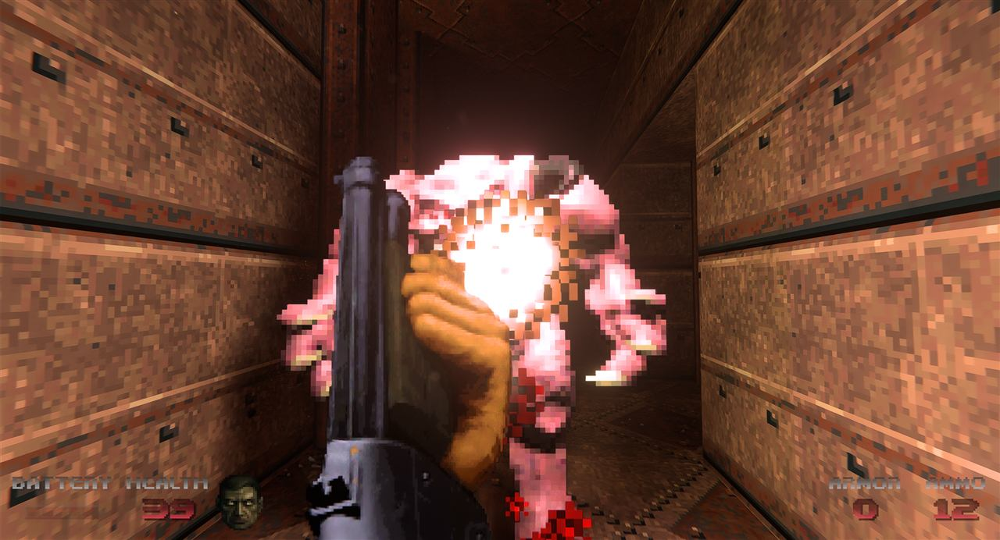<br><sub>Point-blank fireball</sub></td>
</tr>
<tr>
  <td align="center">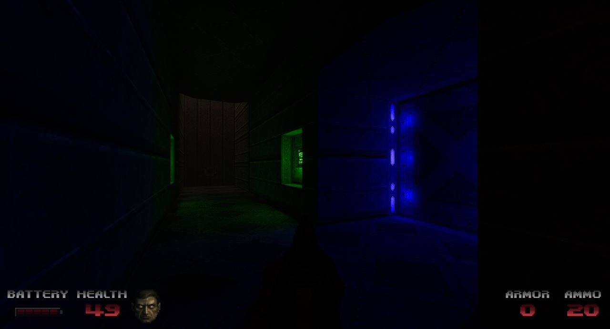<br><sub>Coloured corridor lighting</sub></td>
  <td align="center">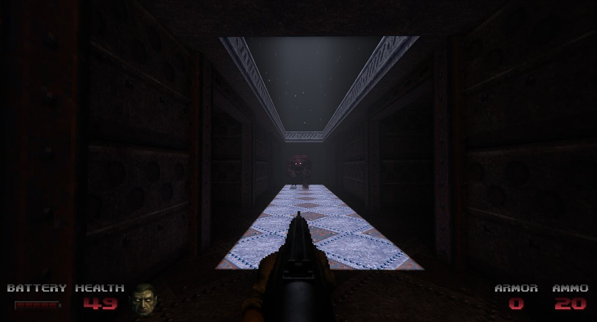<br><sub>Moonlit hallway</sub></td>
  <td align="center">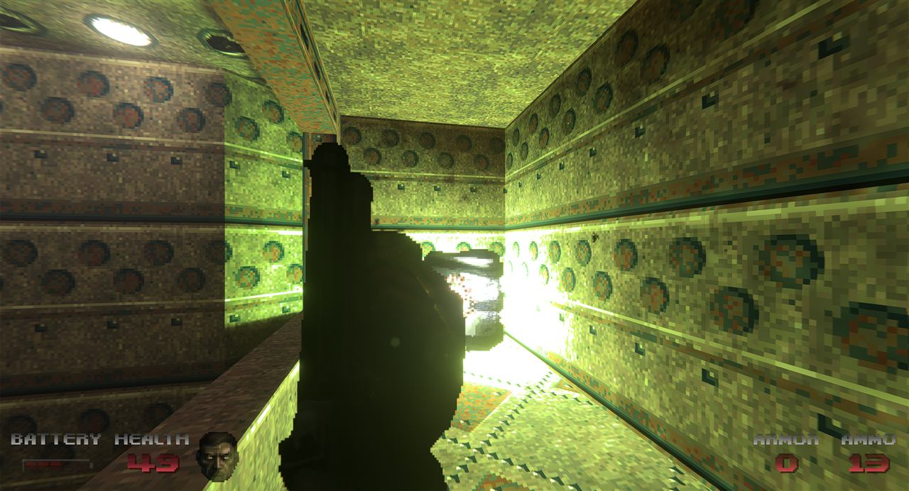<br><sub>PBR tile under a bright fixture</sub></td>
</tr>
<tr>
  <td align="center">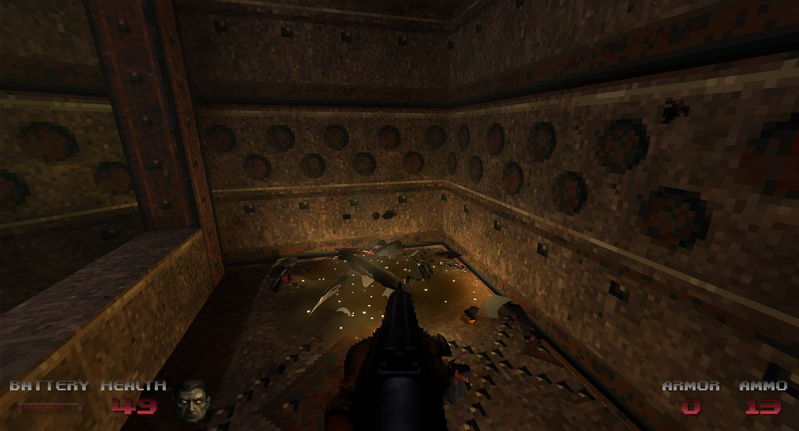<br><sub>Persistent blood</sub></td>
  <td align="center">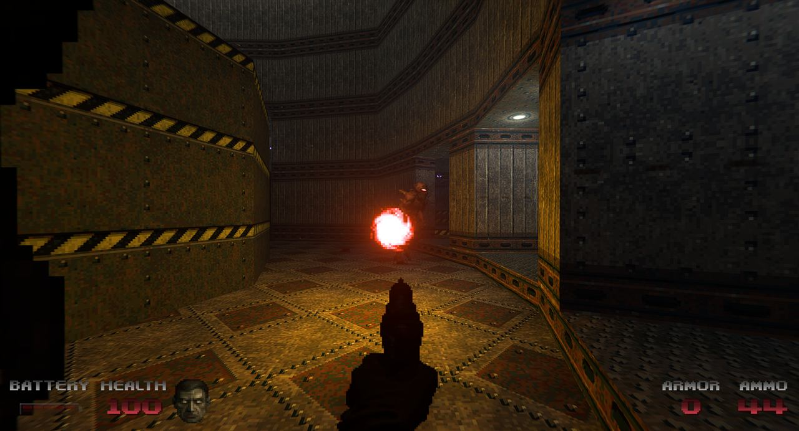<br><sub>Plasma impact mark</sub></td>
  <td align="center">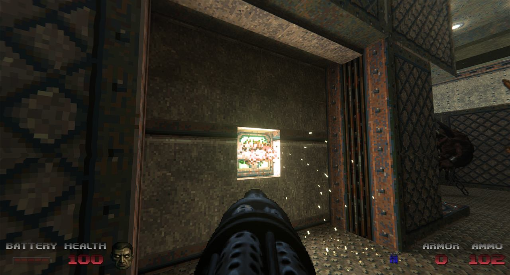<br><sub>Impact sparks</sub></td>
</tr>
<tr>
  <td align="center">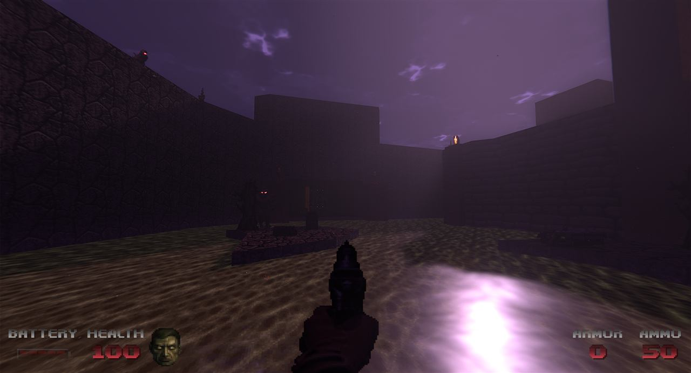<br><sub>Storm clouds and flashlight</sub></td>
  <td align="center">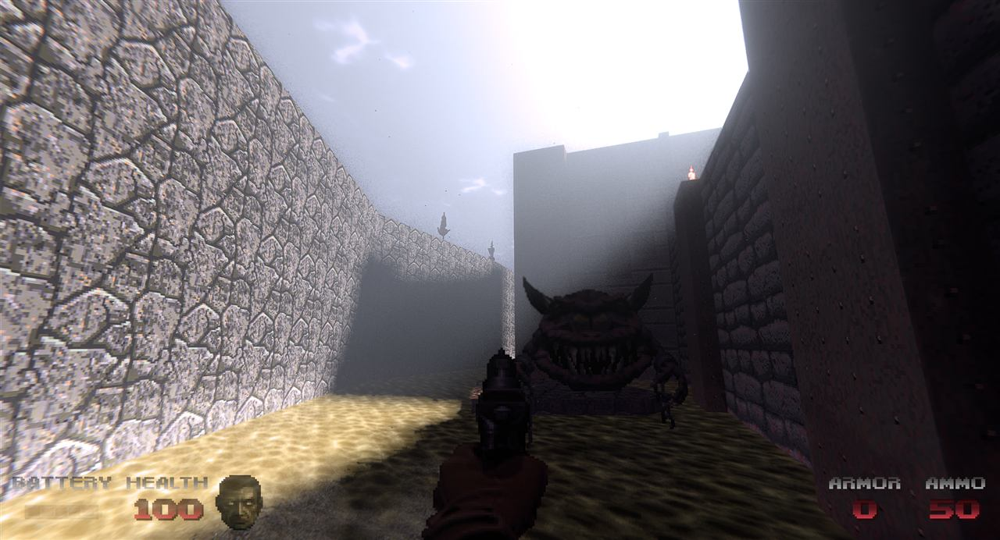<br><sub>Outdoor daylight fog</sub></td>
  <td></td>
</tr>
</table>

<br>


<a id="known-issues"></a>
## ⛧ &nbsp;Known issues

Things that are wrong and known to be wrong.

- MAP05: when at the outdoor area, the moon can get occluded by an invisible wall. It is like a form of "unculling", no fix found yet.
- You can notice textures that look too bright / sticking out. It can happen if their emissive is not well updated, those get fixed over time as I do a real play through the whole game
- Loading a save made on an older version will fail with a clear "save is from an older version" message. This is expected: each update can change map data, which invalidates old saves for that level. Start that level fresh from the console (`map mapXX`) or load a save from an earlier level instead.
- If you played Doom 2 RT before, make sure you set `rt_fluid false` is your `GZdoom_RT2.ini` (Documents > My Games > GzDoom) or type it in the console

<br>


<a id="install"></a>
## ⛧ &nbsp;Install and play

> [!NOTE]
> **Tested on one machine only.** The FSR path has never run on AMD hardware, and DLSS Ray
> Reconstruction is alpha and ships off. Releases cut from `main` are full releases;
> anything tagged off another branch publishes as a `(beta)` pre-release. Bug reports
> welcome.

You need a GPU with hardware ray tracing (NVIDIA RTX, AMD RDNA 2+, Intel Arc) and
a DOOM II you own. Everything else is free.

**1. Download and extract this**

[**Releases**](https://github.com/jlrouzies-fr/doom64-rt/releases) → `Doom64-RT.zip` (~124 MB).
Extract it anywhere — it needs no installer, and the only thing it writes outside its own
folder is GZDoom's config, at `Documents\My Games\GZDoom\gzdoom-rt2.ini`.

**2. Get Doom 64: Retribution and its music, and extract both into `game\`**

| Download | |
|---|---|
| [Doom 64: Retribution v1.5](https://www.moddb.com/mods/doom-64-retribution) | Extract the **whole** download into `game\`, not just the WAD — the brightmaps, the soundfont and the fluidsynth DLLs are all used. |
| [OGG music pack v1.3](https://www.moddb.com/mods/doom-64-retribution/addons/doom-64-retribution-ogg-music-pack-v13) | `D64MUS.ZIP` on the same page. Unzip it into `game\` too. |
| *Optional* — [D64ClassicRecolored](https://www.moddb.com/games/doom-64/addons/d64classicrecolored) | Classic-hued Cacodemon and Pain Elemental. Off by default; drop the wad in `Addons\` (and tick it in the startup window on step 4.). |

**3. Have DOOM II installed**

Steam or GOG — the launcher finds either by itself, so usually there is nothing to
do here. If your `doom2.wad` lives somewhere unusual, the startup check has a
Browse button. [Freedoom Phase 2](https://freedoom.github.io/) works as a free
stand-in, untested here.

**4. Run `launch-doom64-rt.cmd`**

It checks everything first and tells you what is missing, with a link to each
download. Green ticks all the way down, then **RIP AND TEAR**.

Once every line is green, the window offers **Setup is done — go straight to the
game next time**. Tick it and the check stops appearing: it writes `configdone.txt`
beside the launcher, and from then on a double-click goes straight into Doom 64.
The files are still tested on every start, so if one of them later moves or is
deleted the window comes back on its own with the reason. To open it deliberately
— to point at a different `doom2.wad`, or to turn the recolour add-on on or off —
run `launch-doom64-rt.cmd setup`, or just delete `configdone.txt`.

<br>

<a id="building"></a>
## ⛧ &nbsp;Building it yourself

*For working on the project. To just play it, use the [release](#install) — it is the same
thing, already built.*

> [!IMPORTANT]
> Almost nothing needed to *run* the game is in git — engine build, RTGL1 build, SDKs,
> the Python venv, the `sourcecode/gzdoom-rt` checkout, IWAD, Retribution and music are all
> gitignored. What is tracked is our RT materials, our tools, our engine patches and the docs.

<a id="requirements"></a>
### What you need

| | |
|---|---|
| **GPU** | Any GPU with **Vulkan ray tracing** — NVIDIA RTX, AMD RDNA 2 and later, Intel Arc. Path tracing only; there is no rasterized fallback, so hardware RT is not optional. Upscaling is DLSS 2 **or** FSR 2 (`rt_upscale_dlss` / `rt_upscale_fsr2`); DLSS is NVIDIA-only, FSR runs anywhere. Only NVIDIA has been tested here. |
| **OS** | Windows — the build scripts and the win32 surface path. |
| **Toolchain** | Visual Studio **Build Tools 18** with the x64 native toolset, CMake, Python 3.13 with Pillow. The build scripts call `VsDevCmd.bat` from the `…\Microsoft Visual Studio\18\BuildTools\…` path — another edition or version means editing line 3 of both. |
| **IWAD** | A `doom2.wad` **you own** — Retribution is a PWAD and cannot run without one. The Steam or GOG release of DOOM II both work; the launcher looks in the usual install locations and otherwise takes `D64RT_IWAD`. |
| **Stock engine package** | A **gzdoom-rt 1.0.2 release** unpacked to `gzdoom-rt-1.0.2\`. Not optional: `build-gzdoom-rt.cmd` stages `rt\`, `libsndfile-1.dll` and `openal32.dll` out of it, and without that `rt\` tree the engine has no shaders, no `rt\data` and no `rt\wad`. |

### Game files — download these yourself

None of this is redistributed here. Get it from the mod's own ModDB page and drop it in
`Doom64-Retribution\`:

| Download | What to do with it |
|---|---|
| **Doom 64: Retribution v1.5** — [moddb.com/mods/doom-64-retribution](https://www.moddb.com/mods/doom-64-retribution) | **Extract the whole thing**, not just the WAD. It carries `D64RTR[v1.5].WAD`, `D64RTR_BRIGHTMAPS.PK3`, `DOOMSND.SF2` and the two `libfluidsynth` DLLs — all of them are used, and picking files out one at a time is how you end up missing one. |
| **OGG music pack v1.3** — [the addon page](https://www.moddb.com/mods/doom-64-retribution/addons/doom-64-retribution-ogg-music-pack-v13) | Unzip `D64MUS.ZIP` in the same place. Not every track is in it, which is why the soundfont above still matters: without it the MIDI ones fail with `Unable to load : Unable to read header` (the title screen and MAP00 show this). |

> [!NOTE]
> The ModDB download is named **`D64RTR[v1.5].WAD`**. This repo also carries a shell-safe
> `D64RTR_v15.WAD` copy, and the launcher accepts either — those square brackets are a
> wildcard to PowerShell's `Test-Path`, so a naive check reports the file missing while it
> is sitting right there.

The launcher loads the OGG pack rather than the MIDI + `DOOMSND.SF2` route, so the music
pack is required, not optional — `launch-retribution-rt.cmd` passes it on every start.
Retribution's own `D64RTR_INSTRUCTIONS.TXT` §"Music" covers the soundfont alternative if
you would rather have the MIDIs.

### The IWAD

DOOM II is still sold, so this project does not point anyone at a pirated IWAD. Buy it on
Steam or GOG — or use the free [Freedoom](https://freedoom.github.io/) Phase 2 IWAD if you
want a no-purchase route, though nothing here has been tested against it.

The launcher searches the usual Steam and GOG install paths, plus `doom2.wad` beside the
repo. If yours lives elsewhere, point at it rather than editing the script:

```powershell
$env:D64RT_IWAD = "C:\Path\To\doom2.wad"
```

Everything else — engine, deps, mod files, tools — now resolves relative to the repo, so
the clone can live anywhere.

<a id="dependencies"></a>
### Dependencies — all under `deps\`, never Program Files

> [!IMPORTANT]
> The engine and the path tracer must be **this project's forks, on the `doom64-rt`
> branch** — not their upstreams. Both carry changes this repo depends on (the RT feature
> file split, the froxel changes fog and smoke need, the emissive and translation fixes).
> Upstream will build, then behave wrong in ways nothing reports.
> The project repo itself is on **`main`**; `dev` is where work lands before it is merged
> and tagged.

```powershell
git clone https://github.com/jlrouzies-fr/doom64-rt.git Doom64-RT
cd Doom64-RT
git clone --recurse-submodules -b doom64-rt https://github.com/jlrouzies-fr/gzdoom-rt.git sourcecode\gzdoom-rt
git clone --recurse-submodules -b doom64-rt https://github.com/jlrouzies-fr/RTGL.git      deps\RTGL
git clone https://github.com/NVIDIA/DLSS.git                                              deps\DLSS   # NVIDIA only
```

> [!CAUTION]
> **`--recurse-submodules` is not optional.** The engine keeps `unordered_dense` as a
> submodule under `src\common\rendering\rt\`, and RTGL1 keeps six (imgui, glfw, cgltf,
> glaze, glm, DirectX-Headers). Without them the engine compiles for several minutes and
> then fails every RT translation unit at once with
> `Cannot open include file: 'unordered_dense/…'`. If you already cloned flat:
> `git -C sourcecode\gzdoom-rt submodule update --init --recursive` (and the same for
> `deps\RTGL`).

Only the DLSS SDK comes from its own upstream — it supplies the NGX snippets, and
`build-rtgl.cmd` currently requires it. On non-NVIDIA hardware that dependency has to come
out of the build (`-DRG_WITH_NATIVE_DLSS=OFF`) and upscaling falls back to FSR2.

<a id="build"></a>
### Build

```powershell
.\tools\build-gzdoom-rt.cmd     # vcpkg + ZMusic + gzdoom-rt  -> build\RelWithDebInfo\gzdoom.exe
.\tools\build-rtgl.cmd          # shaders + RTGL1.dll         -> build\RelWithDebInfo\rt\bin\
```

Both scripts stage their output into `sourcecode\gzdoom-rt\build\RelWithDebInfo\`, so run
the engine build first. Three things they do deliberately, each one paid for:

- **`build-rtgl.cmd` aborts if a shader fails.** `GenerateShaders.py` exits 0 even when
  `glslangValidator` rejects a shader, which would otherwise ship the *previous* SPIR-V into
  a playtest.
- **It clears the object files when `ShaderCommonC.h` changes.** The generated uniform
  struct is not a tracked CMake dependency, so a stale `.obj` keeps the old
  `sizeof(ShGlobalUniform)` and every field past the old size silently reads **zero** — no
  crash, no validation error. That cost a full day once.
- **It checks the copy of `RTGL1.dll` succeeded.** The DLL is locked while gzdoom is
  running, and a silent failure means fresh shaders get tested against the old renderer.
  Kill `gzdoom.exe` before building.

<a id="first-run"></a>
### First run

There is no first-run ritual any more — `build-gzdoom-rt.cmd` does it. Just play:

```powershell
.\tools\launch-retribution-rt.cmd          # MAP01
.\tools\launch-retribution-rt.cmd 13       # any map, 1-34
.\tools\launch-retribution-rt.cmd menu     # boot to the title screen
```

For the record, these are the three things the build script now does for you at the end of
staging, each of which fails *silently* when skipped, and each of which has to be redone
after any clean rebuild because the stock `rt\` tree is restaged wholesale:

| Step | Why it matters |
|---|---|
| writes `rt\RTGL1.json` with `developerMode: true` | RTGL1 only ever **reads** this file (`VulkanDevice_Init.cpp:228`, `.value_or(default)`). No file means `developerMode: false`, every authored PNG material ignored, KTX2 only — and nothing warns you. The game just looks stock. A **release** additionally gets `debugWindows: false`: the two used to be one flag, so hiding RTGL1's ImGui window meant giving up the authored materials. |
| stages `Retribution-RT-Materials\rt\` into the engine `rt\` | The materials themselves. |
| copies `rt-wad-overlay\` into `rt\wad` | `rt\wad` is appended **after** every `-file` PWAD, so without it the stock RT menu art overrides Retribution's. |

None of that needs Python. The interpreter is only for the authoring tools —
generators, scanners, gallery builders — and for RTGL1's own shader generation when you
build it.

<br>

<a id="launchers"></a>
## ⛧ &nbsp;Launchers

*Also the developer path — these run the game out of a source checkout, not out of the release.*

<table>
<tr><th align="left">Command</th><th align="left">What you get</th></tr>
<tr>
  <td><code>tools\launch-retribution-rt.cmd [1-34|menu]</code></td>
  <td>The game. Native RTGL1 path tracing, A-SVGF denoiser, DLSS or FSR upscaling.</td>
</tr>
<tr>
  <td><code>tools\ab.cmd &lt;arm&gt; [map]</code></td>
  <td>A/B runner. Arms are config files in <code>tools\arms\*.cfg</code>, never console commands.</td>
</tr>
<tr>
  <td><code>tools\launch-enemy-gallery-rt.cmd</code></td>
  <td>MAP98 — enemy eye / emissive debug hall.</td>
</tr>
<tr>
  <td><code>tools\launch-texture-gallery-rt.cmd</code></td>
  <td>MAP99 — texture PBR gallery.</td>
</tr>
<tr>
  <td><code>tools\ui-wpf.cmd</code> · <code>tools\ui-classic.cmd</code></td>
  <td>Open a startup-check window on its own, without starting the game — the WPF one that ships, or the WinForms fallback.</td>
</tr>
</table>

> [!NOTE]
> The launcher pins ~600 cvars via `+exec tools\d64rt-pins.cfg` rather than on the command line.
> That is deliberate: `cmd.exe` truncates at 8191 characters, and the old inline form silently
> dropped the tail — arms ran on defaults while the tool printed values it never applied.

> [!NOTE]
> **The startup window** is `launch-doom64-rt-ui.ps1`, WPF over Windows PowerShell 5.1 —
> chosen over WinForms because WPF scales itself on a 4K display and lets every control be
> retemplated, down to the checkbox tick and the scrollbar. The WinForms original stays as
> `launch-doom64-rt-ui-classic.ps1`: if WPF cannot start it answers exit code **2** and the
> `.cmd` runs that one instead, so a machine that cannot draw the window is never a machine
> that cannot play. What either window *finds* is in `launch-doom64-rt-checks.ps1`, shared by
> both — the two differ only in how they look. `D64RT_UI=classic` picks the fallback on purpose.

<br>

<a id="developers"></a>
## ⛧ &nbsp;For developers

Everything in this project is written down — each feature, each fix, and each dead end,
usually written the day it cost us something.

### → &nbsp;**[DEVELOPERS.md](DEVELOPERS.md)** — the index of every doc in the repo

Grouped by feature docs, the lighting-repair pipeline, materials and models, tooling,
generated inventories, and the historical briefs kept for *why* rather than *how*.

Three that matter more than the rest:

| | |
|---|---|
| [`AGENTS.md`](AGENTS.md) | The working handbook — diagnostic procedure for a wrongly-lit surface, the `rt/` source map, how to add a cvar, and 36 numbered pitfalls not to repeat. |
| [`compat-patches.md`](docs/compat-patches.md) | Every engine and RTGL1 change we made, dated, with the reason. |
| [`docs/open-issues-rt-lighting.md`](docs/open-issues-rt-lighting.md) | What still fails. |

<br>

---

<a id="art"></a>
## ⛧ &nbsp;Art changes

This project is mostly a lighting mod, but it does redraw a handful of textures — every
one of them recorded here so none is a quiet change. All ship **enabled**, in the
launcher's own file list, so this is what the game looks like out of the box. (There is
also an optional, off-by-default recolour add-on — see [Install and play](#install).)

### SFLATAS — the ceiling lamp pane

<table>
<tr>
  <th align="center">Before</th>
  <th align="center">After</th>
</tr>
<tr>
  <td align="center"></td>
  <td align="center"></td>
</tr>
<tr>
  <td align="center"><sub>2×2 working bulbs per 64-unit tile — four lights</sub></td>
  <td align="center"><sub>three smashed, one still burning — one light, nothing moved</sub></td>
</tr>
</table>

The glass is repainted; **no bulb is moved**. That is the whole trick, and §"Why this
edit and not another" below is why it matters.

**Why.** A grating only casts a legible shadow when its light comes from one compact
source. Measured in the shadow lab (`tools/build_shadow_lab.py`, the same fixture alone
in a dark room):

| lights on the pane | result |
|---|---|
| 1 | crisp diamond shadows on floor, walls and ceiling |
| 4 | shadows, once the intensity beats the bounce fill |
| 16 | nothing, at any source radius |

The lamp pane places one light per painted bulb, and Doom 64 paints those bulbs 32 map
units apart — **one metre**. The cage grating's openings are about half that. Once the
lights are further apart than the occluder's features, each one lays down an offset copy
of the mesh shadow that fills in the previous one's gaps, and the pattern cancels. That
is not a renderer bug: a real ceiling of metre-spaced bulbs behind a half-metre mesh
washes out too. It is why the caged zombie on MAP01 stood in a shadowless glow.

**Why this edit and not another.** The obvious version — repaint the pane as a single
bulb in the middle of the tile — was built first, and it is worse. Moving painted
geometry means moving it in the albedo *and* in the normal, height and roughness maps;
then the light has to follow it; then every pane needs a per-sector texture offset so a
wall does not slice the one bulb that is left, and the light has to follow that too.
Breaking three bulbs changes **nothing's position**. All four housings still exist, so
the authored relief maps are still correct and are left alone, and the flat keeps its
original tiling, so no sector needs an offset. It also reads as a place rather than as a
texture edit: this is an overrun military installation, and the maintenance stopped.

**How it was made.** `tools/gen_broken_bulb_flat.py`. The albedo is hand-painted; the
tool works out which bulb is still intact by measuring luminance in the authored bulb
windows (157 against 53/64/94 — not a judgement call), keeps that one blob in the `_e`
emissive mask and clears the other three, and restores the authored `_n`/`_h`/`_orm`. The
engine's `SoloBulbTextures` then puts one light on the survivor — at world **(16, 16)**
for a bulb the image draws at (16, 48), because a ceiling flat's world Y is `64 − imageY`.

### Blood, poison and sludge — new art, and real depth on two of them

Doom 64's three non-water liquids (`D64B*` blood, `D64N*` poison, `D64S*` sludge) are the
same flat 64-frame animated design in three palettes: a marbled cellular pattern with no
depth, drawn to be lit by the classic renderer's flat ambient rather than a path tracer.
Under RT lighting a liquid with no relief and no wet/dry contrast reads as a plastic
colour swap of water, whatever body colour it is tinted.

<table>
<tr>
  <th align="center">Before (stock)</th>
  <th align="center">After</th>
</tr>
<tr>
  <td align="center">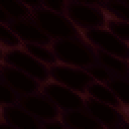</td>
  <td align="center">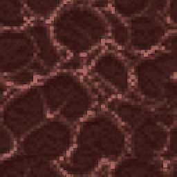</td>
</tr>
<tr>
  <td align="center"><sub>D64B1_/D64B2_ — flat cellular pattern, no depth</sub></td>
  <td align="center"><sub>coagulated plates with real relief; the veins have a flow map running along them</sub></td>
</tr>
<tr>
  <td align="center">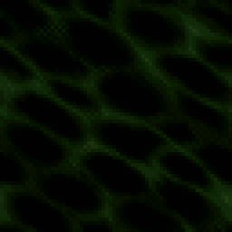</td>
  <td align="center">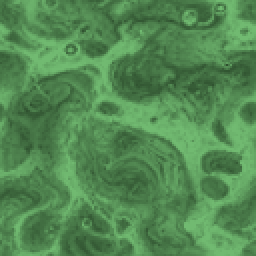</td>
</tr>
<tr>
  <td align="center"><sub>D64N1_/D64N2_ — flat cellular pattern</sub></td>
  <td align="center"><sub>marbled toxic swirl; art only, no relief</sub></td>
</tr>
<tr>
  <td align="center">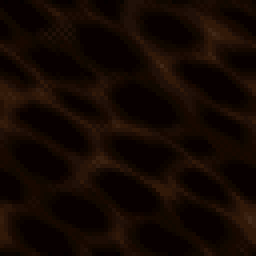</td>
  <td align="center">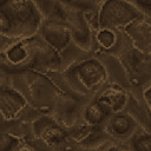</td>
</tr>
<tr>
  <td align="center"><sub>D64S1_/D64S2_ — flat cellular pattern</sub></td>
  <td align="center"><sub>a mud bed: lumps, rims and pits in relief, reflection turned off</sub></td>
</tr>
</table>

All three get new reference art, tiled and colour-matched to the game's stylized liquid
shader (`d64r-liquid-art.wad`, one `TEXTURES` lump redefining every frame as a single
unshifted image — the stock definition composites two copies of the patch offset one unit
apart per frame purely to fake churn, and on a crisp tile that reads as a ghosted double
image instead). Depth is not automatic from there: the primary pass overwrites any normal
map on a liquid with the animated water wave, so it takes an engine-side liquid id and a
per-liquid relief weight (`rt_blood_relief`, `rt_sludge_relief`) to give it back.

**Blood** additionally gets a flow map — a detail texture advected along the vein network's
own baked direction, so liquid visibly runs down the channels rather than the whole surface
pulsing brighter. **Sludge** additionally gets its water *reflection* switched off
(`rt_sludge_refl 0`): a mirror is the single loudest thing saying "this is water with brown
paint on it", and turning it off also took a stability bug with it — the checkerboard split
that reflection relies on rebuilds half the screen's columns from their neighbours, which
crawls under a moving light on a high-contrast authored normal and was mistaken for a
denoiser problem for a while. **Poison** gets the art change only: no relief, no flow.

All three also stop projecting caustics onto nearby walls — a caustic is light refracted
*through* a fluid and focused on what lies beyond it, and all three are painted opaque, so
the rippling pool-light they used to throw (identical to water's) was the loudest single
thing undercutting the new art. Only water still does it.

**Why.** `docs/rt-blood-pools.md` — the fullest post-mortem in this repo, including two
motion-effect designs that were tried, judged not to read as flow, and thrown out before
the current flow map, and the checkerboard bug above start to finish.

<br>

---

<a id="credits"></a>
## ⛧ &nbsp;Credits

This project renders someone else's game, in someone else's engine, with someone else's
path tracer. **[CREDITS.md](CREDITS.md) is the full list** — this is the short one.

<table>
<tr><th align="left">Project</th><th align="left">By</th></tr>
<tr>
  <td><b>RTGL1</b> / RayTracedGL1 — the path tracer<br><sub>MIT</sub></td>
  <td><b>Sultim Tsyrendashiev</b> (© 2020–2023) and <b>Vasilii Shirokii</b> (© 2024).
      Sultim is also the author of <i>Doom: Ray Traced</i>, which this project's material
      and lighting conventions follow.</td>
</tr>
<tr>
  <td><b>GZDoom: Ray Traced</b> — the engine we build<br><sub>GPLv3</sub></td>
  <td><b>Vasilii Shirokii</b> (<a href="https://github.com/vs-shirokii/gzdoom-rt">vs-shirokii</a>) —
      the RT renderer our engine work extends is his.</td>
</tr>
<tr>
  <td><b>GZDoom</b><br><sub>GPLv3</sub></td>
  <td>The <b>ZDoom</b> / <b>GZDoom</b> teams — <b>Christoph Oelckers</b>,
      <b>Magnus Norddahl</b>, <b>Randy Heit</b>, <b>Alexey Lysiuk</b>,
      <b>Rachael Alexanderson</b>, <b>Braden Obrzut</b> and many contributors.
      Doom source © 1997 <b>id Software</b> and <b>Raven Software</b>.</td>
</tr>
<tr>
  <td><b>Doom 64: Retribution v1.5</b> — the game</td>
  <td><b>Nevander</b>, plus the long list of authors in Retribution's own credits —
      <b>Kaiser</b> (Doom 64 EX, WadGen, Absolution TC), <b>Elbryan42</b>,
      <b>AgentSpork</b>, <b>Steven Searle</b>, <b>Dreadflame</b>, <b>Footman</b>,
      <b>Cage</b>, <b>Almonds</b>, <b>NMN</b> and others.</td>
</tr>
<tr>
  <td><b>Doom 64</b> (1997) — the original</td>
  <td><b>Midway Games</b> and <b>id Software</b>. Music and sound by <b>Aubrey Hodges</b>.</td>
</tr>
<tr>
  <td><b>DLSS 2</b> / Ray Reconstruction</td>
  <td><b>NVIDIA</b>.</td>
</tr>
</table>

<br>

---

<div align="center">
<sub>
Built on <a href="https://github.com/vs-shirokii/gzdoom-rt">gzdoom-rt</a> and
<a href="https://github.com/sultim-t/RayTracedGL1">RTGL1</a> over
<b>Doom 64: Retribution</b> — see <a href="CREDITS.md">CREDITS.md</a>.<br>
<i>Doom</i> and <i>Doom 64</i> are trademarks of id Software. This is a non-commercial fan project,
not affiliated with id Software, Bethesda, Midway or NVIDIA.
</sub>

<br>

<sub>
🤫 &nbsp;<i>Don't tell Alex it's vibe coded.</i><br>
<sub>…it's declared right there at the top, actually. Every light still had to survive a human looking at it.</sub>
</sub>
</div>
