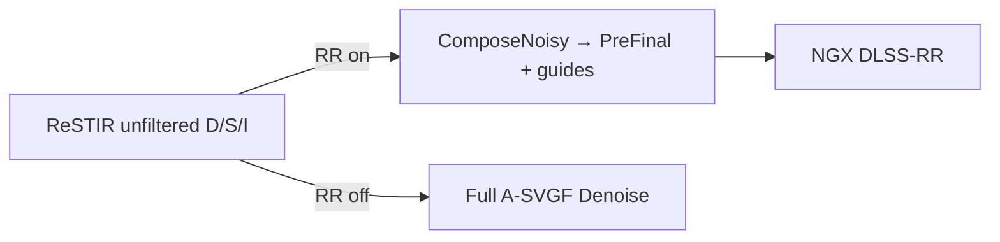

# DLSS Ray Reconstruction noise — investigation log

Living doc for **RR salt / walk noise / unfiltered-direct bleed** on Retribution.  
Not a cheer sheet: record symptoms, failed fixes, working knobs, and next experiments.

**Related:** `AGENTS.md`, `open-issues-rt-lighting.md`, `compat-patches.md`, `material-authoring-spec.md`

**Play path:** `tools/launch-retribution-rt.cmd` → `sourcecode/gzdoom-rt/build/RelWithDebInfo/`  
**RR path in code:** `deps/RTGL` — `ComposeNoisy` (raw unfiltered only) → NGX DLSS-RR (`nvngx_dlssd.dll`)  
`AccumulateForRR` / `rt_rr_temporal` path is **dead** for play — see §4 / §4.1.

---

> # ⚠️ READ §10 FIRST (2026-08-07)
>
> **DLSS-RR was not running for any observation in §1–§9.** Three independent
> faults kept it off (compiled out of the DLL, a persisted Dev override, and a
> stale `rt_upscale_fsr2` that clobbered the DLSS upscaler), behind three layers
> of muted diagnostics. Everything recorded below as "RR looks like X" was
> measuring **A-SVGF**.
>
> All three are fixed and RR is now verified running. **§10 supersedes the
> conclusions in §1, §3.3 and §9.** The investigation is closed with a
> recommendation, not an open hunt — do not resume §7 without reading §10.

---

## 1. Symptom (current)

| | |
|---|---|
| **What** | Salt / grain in the **final** image under native DLSS-RR (`+rt_upscale_dlss 2 +rt_rayreconstr 1`). |
| **Spatial match** | Pattern and locations match Dev debug **Unfiltered diffuse direct** (user did *not* leave that view on — same look when debug is off). |
| **Not** | Emis wall wash / sky leak (mapboost / sky A/B). Not HUD blockiness (Dev Override → Linear/Nearest). |
| **When noticed** | 2026-08-05: RR felt **much noisier** than recent memory; A-SVGF (RR off) looked **stabler** — expected given the pipeline (§2). |
| **Working hypothesis (user)** | Got worse after **full-tree PBR / ORM treatment** (esp. MAP02), but **stripping PBR is not the solution** — keep authored `_n`/`_orm`/`_h` and fix RR/lighting interaction. |

### 1.2 Transient-light ghosting (2026-08-05 ~16:30)

| | |
|---|---|
| **Symptom** | Barrel explosions, muzzle flashes, and other transient bright lights **linger** in the image for ~10 seconds after the source is gone. |
| **Mechanism** | DLSS-RR accumulates temporal history. When a bright event ends, RR's history still contains the lit pixels and slowly fades them out — no mechanism to signal "discard history here." |
| **Why A-SVGF doesn't do this** | A-SVGF's temporal accumulation has anti-firefly + variance-driven history reset. RR's history is ML-driven with no explicit firefly/transient handling. |
| **Guide fixes alone cannot fix this** | Corrected diffuse/specular guides help RR separate lighting from materials, but do not tell RR when to discard stale history. |
| **Required inputs** | NGX supports `pInDisocclusionMask` (write `10000.0` to force history discard) and `pInBiasCurrentColorMask` — see `rr-noise-fix-proposals.md` §5. |
| **Fix path** | Per-frame disocclusion mask: any pixel whose Rec.709 luminance changed by more than a threshold vs the previous frame gets `10000.0`. Simplest first pass: write it from `CmNoisyCompose` comparing current vs `DiffColorHistory` (previous frame's guide). |
| **Implemented (2026-08-06)** | Landed in `deps/RTGL` + `gzdoom-rt`, **pending in-game A/B**. Refinement over the first-pass idea: the signal is the **lighting-only luminance** `lum(UnfilteredDirect + UnfilteredIndir)` (albedo- and view-independent — the albedo guide would never see a transient), compared per **16×16 tile mean** (per-pixel compares are useless at 1 spp; 256-tap tile means cut relative noise ~16×), **motion-reprojected** via `MotionDlss` so walking doesn't fire it. Fires symmetric (on/off) when tile ratio > `rt_rr_disocc_ratio` (default 3.0) AND absolute delta > `rt_rr_disocc_mindelta` (0.01). Mask written by `CmNoisyCompose` → `pInDisocclusionMask`. Debug view: `rt_rr_disocc_show 1` tints fired tiles red. Kill switch: `rt_rr_disocc 0`. |

---

## 2. Why “non-RR looks stabler” is not a paradox

With DLSS-RR enabled (play default), RTGL does:

```
ReSTIR unfiltered direct/spec/indir
  → ComposeNoisy (raw → PreFinal + RR guides)
  → NGX DLSS-RR
```

and **skips the entire A-SVGF `Denoise()`**, including:

1. Temporal accumulation  
2. Anti-firefly (on *accumulated* buffers)  
3. Variance + spatial atrous  

A-SVGF’s stability under blinking analytic lights mostly comes from **(1)**. RR alone is asked to denoise **1-spp ReSTIR** that hard-cuts when lights blink. Hostile input; ASVGF forgives it; RR does not.

NVIDIA guidance (Streamline / Remix / peer denoisers): need **high-quality noisy inputs** — not broken temporal light animation, and not heavily pre-mangled signals.

---

## 3. Confirmed amplifiers (A/B)

### 3.1 Ceiling inset lamps (analytic direct) — **CONFIRMED**

| | |
|---|---|
| **A/B** | `rt_ceiling_lamps 0` → noise pattern largely **gone**; effect lost. |
| **Mechanism** | Bright shadow-casting spheres (`SFLATAS*` / `SPORT*`, peak was **900**) with **hard on/off** and **dropping the light from the upload list** when dark → ReSTIR + RR history hard-cut every blink. |
| **Shows as** | Unfiltered diffuse direct salt → bleeds into final under RR. |
| **Keep the effect** | Soft fade + dim floor (do **not** delete light): `rt_ceiling_lamp_fade`, `rt_ceiling_lamp_off > 0`, stable `uniqueID` every frame. Same lesson as `rt_mzlflsh_fade`. |
| **Also** | `rt_ceiling_lamp_maxspan` can skip analytics on huge hall sectors (MAP02 mid-ceiling white blink risk). |

### 3.2 Full-tree PBR / ORM (MAP02 especially) — **SUSPECTED, DO NOT NUKE**

| | |
|---|---|
| **What shipped** | 2026-08-04 `ae2846e`: metallic AI demotion + roughness floor across **763** `_orm` maps. Mean metal ~0.13→0.02; dielectric roughness floored ~0.82. |
| **Why it can worsen RR** | Dielectric walls take **full diffuse** (`ro_d = albedo × (1−metallic)`). After demotion, lamp/dynlight ReSTIR variance is louder in the diffuse channel. High-frequency `_n` + ORM still stress RR guides (earlier walk shimmer A/B’d to **roughness G**). |
| **Why stripping PBR is wrong** | Loses CE look and Phase 4 track. Goal is **RR-compatible PBR**, not flat albedos. |
| **Safe A/B (live)** | Dev → Materials A/B: strip normals / ORM / height **separately** — diagnose without deleting overlays. |

### 3.3 Dev Override / sticky persist — ~~RED HERRING~~ **WRONG, see §10.1**

> **Superseded 2026-08-07.** "Salt is not Dev-settings-dependent" was wrong in the
> most consequential way possible: sticky `rayReconstructionSticky` was overriding
> `rt_rayreconstr` **even with Override unchecked**, so the salt being compared was
> A-SVGF's. Fixed — sticky flags and `ovrd_enable` no longer restore from disk.

Original text: salt itself is not Dev-settings-dependent. Still: keep **Override
unchecked**. Sticky `rt/devmode_settings.json` can re-enable Override / temporal /
Linear after a session and confuse A/B — wipe or Reset if the image goes weird.

---

## 4. Failed / harmful “fixes” (do not repeat)

| Attempt | Result | Lesson |
|---|---|---|
| ASVGF-style **min/max neighbor clamp** in `CmNoisyCompose` | **No-op** on dense ReSTIR sparkle; also hurt walk stability. | Only helps sparse outliers *after* temporal accum. |
| Remix-style **luminance boiling** (mean×5) + sample max-lum 500 | User: **IQ worse**. | Do not pre-mangle RR’s noise distribution. |
| **`rt_rr_temporal 1`** — A-SVGF temporal → ComposeNoisy → RR | User: **faded duplicate / ghost “depth buffer” view** (`screen/rrasvgghost.png`). | Double reprojection (ASVGF + RR) and/or checkerboard vs regular sampling mismatch (`getCheckerboardPix` vs regular `pix` on DiffTemporary). **Never ship; do not re-wire.** |
| Turning lamps off / nuking PBR | Clears noise; kills feature / look. | A/B only — not ship. |
| `rt_normalmap_stren` / `rt_heightmap_stren` ≫ 1 | Known RR destroyer. | Launcher stays at **1**. |

### 4.1 Black world / only muzzle sprites (2026-08-05 ~14:13) — **FIXED**

Regression after hard-removing `AccumulateForRR` from the RR frame path (ghost fix).

| | |
|---|---|
| **Symptom** | Nearly **black** scene; only firing / weapon **sprites** visible. |
| **Cause** | `CmNoisyCompose` still had a `rrTemporalPrefilterEnabled` branch that sampled **DiffTemporary / SpecAccum / IndirAccum**. Writer (`AccumulateForRR`) was gone → empty buffers → black PreFinal. Raster sprites (muzzle) still drew on top. |
| **Also found** | Dev `ovrd_enable: true` had come back sticky in `rt/devmode_settings.json` (saturation zeros etc.) — always Reset/force Override off after bad sessions. |
| **Fix** | (1) Delete temporal read branch from `CmNoisyCompose.comp` — **always** unfiltered ReSTIR. (2) Force `ovrd_enable: false` + temporal sticky off in Dev JSON. (3) Rebuild `tools/build-rtgl.cmd`. |
| **Do not** | Re-add a ComposeNoisy temporal branch without a matching writer that runs every RR frame, and a checkerboard-correct design. |

---

## 5. Landed mitigations (keep; still incomplete)

| Knob / change | Role |
|---|---|
| `rt_ceiling_lamp_fade` **8** + `rt_ceiling_lamp_off` **0.12** | Soft blink; light stays in ReSTIR list |
| `rt_ceiling_lamp_intensity` **700** | Was 900; dial if salt returns |
| `rt_ceiling_lamp_radius` **0.10** | Slightly softer source |
| Soft muzzle `rt_mzlflsh_fade` | Hard-cut lesson for player flash |
| ORM roughness floor + metal demotion | Walk shimmer; may still interact with lamp salt — **tune**, don’t delete |
| Dev Materials A/B | Live strip N/ORM/H/E without Override |
| `rt_rr_temporal` **0** + ComposeNoisy raw-only | Ghost path disabled; black-world regression fixed |
| Dev Override forced off | After sticky Override caused confusion / blackouts |
| **RR disocclusion mask** (`rt_rr_disocc`) | Transient-light linger / occluded-glow ghosting: tile-luminance change → history discard sentinel 10000.0 |

**Code touchpoints**

- `deps/RTGL/Source/VulkanDevice.cpp` — RR → `ComposeNoisy` only (no `AccumulateForRR`)
- `deps/RTGL/Source/Denoiser.cpp` — `ComposeNoisy`; `AccumulateForRR` still exists but **unused** on RR path
- `deps/RTGL/Source/Shaders/CmNoisyCompose.comp` — **raw unfiltered only** (no DiffTemporary); RR guides + disocclusion mask
- `deps/RTGL/Source/DLSSRR.cpp` — guide bindings, `pInDisocclusionMask`, null `pInSpecularHitDistance`
- `sourcecode/gzdoom-rt/.../rt_main.cpp` — ceiling lamps, `rt_rr_temporal`
- Launcher: soft lamp cvars + `+rt_rr_temporal 0`

---

## 6. Pipeline (play default)



Safe stability lever for blink: **soft analytic-light fades**, not ComposeNoisy clamps and not ASVGF-temporal-into-RR.

---

## 7. Next experiments (ordered)

> **Superseded by §10.4 (2026-08-07).** Items 1–4 below were formulated against
> observations that were actually A-SVGF, and 1–3 have since been measured with
> RR genuinely running and found to make no difference. Do not resume this list;
> the one live item is ReSTIR decorrelation (item 6 here / §10.4).

MAP01 spawn + MAP02 dark/key. Prefer Dev Materials A/B over deleting mats.

1. **Lamp energy without kill** — keep fade/off; A/B intensity `400` / `700` / `900` and radius `0.08` / `0.12` / `0.16`.
2. **PBR channel isolation (MAP02)** — strip normals only → ORM only → height only; then targeted authoring, not full PBR rollback.
3. **Guide quality** — motion vectors / linear depth / roughness packing if walk-only salt remains after soft lamps.
4. **Sensitivity** — `rt_illum_sens_direct` A/B.
5. **Do not** re-enable `rt_rr_temporal` / ComposeNoisy temporal reads — ghost + black-world hazards.
6. **Optional later** — RTXDI reservoir boiling *inside* ReSTIR (not ComposeNoisy).

**Out of scope / don’t**

- Delete Retribution-RT-Materials PBR as the “fix”
- Re-enable boiling / min-max / temporal-into-RR without a new theory + A/B
- Leave Dev **Override** checked across sessions
- Raise normal/height strength above ~1

---

## 8. Quick console cheat sheet

```
rt_ceiling_lamps 0          // A/B: salt from analytic ceiling lights?
rt_ceiling_lamps 1
rt_ceiling_lamp_intensity 400
rt_ceiling_lamp_off 0.12
rt_ceiling_lamp_fade 8
rt_rr_temporal 0            // REQUIRED (ghost if 1; black if Compose reads empty temporal)
rt_rr_disocc 1              // disocclusion mask (transient linger fix); 0 = A/B off
rt_rr_disocc_ratio 3.0      // tile lum ratio to fire; lower = more responsive, noisier
rt_rr_disocc_mindelta 0.01  // absolute delta floor (near-black guard)
rt_rr_disocc_show 1         // debug: tint fired tiles red
rt_rayreconstr 0            // full A-SVGF reference (world returns → RR/compose path)
rt_dynlight 0               // split dynlights vs ceiling lamps
```

Dev: Materials A/B → strip N/ORM/H; keep **Override** off; leave **RR temporal prefilter** off (UI may still exist; Compose ignores it).

---

## 9. Status (2026-08-05 ~16:30)

| Item | State |
|---|---|
| Debug channel = unfiltered direct | Confirmed |
| Ceiling lamps amplify | Confirmed |
| Soft lamp fade | **Landed** (best current lever for lamp salt) |
| Screen-space boiling / min-max | **Failed** — IQ worse |
| A-SVGF temporal before RR | **Failed** — ghost; call removed; ComposeNoisy temporal branch **deleted** |
| Black world / muzzle-only | **Fixed** — empty DiffTemporary after writer removal (§4.1) |
| Dev Override sticky | Forced **off** in `devmode_settings.json` (again after blackout) |
| Full-tree PBR as regression driver | **Suspected**; do not strip overlays |
| DLL version | **310.7.0 (latest)** |
| **pInSpecularHitDistance = nullptr** | **Landed** — was FB_DEPTH_WORLD |
| **Corrected RR guides (diffuse + specular)** | **Landed** — diffuse to DiffColorHistory, spec = envBRDFApprox2×mod; sky=(0.5,0.5,0.5) |
| **Transient-light ghosting (barrel/muzzle linger)** | **Disocclusion mask landed (2026-08-06), pending in-game A/B.** Tile-luminance-change mask → `pInDisocclusionMask` sentinel 10000.0. See §1.2. |
| **Guide fixes + null hitDistance: net effect** | **No visible improvement.** Salt still present; ghosting from transients dominates any guide-correction benefit. Guide fixes are necessary but not sufficient — RR needs explicit history-management signals (disocclusion, biasCurrentColor, responsivity) to be usable. |
| Muzzle flash weakness | Reported; likely from guide modulation or specularHitDistance removal; investigate after ghosting fix |
| Exposure/emission baked into RR input | **Open** — pipeline reorder deferred |
| ReSTIR decorrelation | **Open** |
| Transparency layer | **Open** |

**Changes this session (`deps/RTGL`):**
- `Source/DLSSRR.cpp:397`: `pInSpecularHitDistance = nullptr` (was FB_DEPTH_WORLD)
- `Source/DLSSRR.cpp:330-336,358`: diffuse-albedo binding moved to `FB_DIFF_COLOR_HISTORY`
- `Source/Shaders/BRDF.h`: added `envBRDFApprox2()` (GGX preintegrated; coefficients from RR guide §3.4.2)
- `Source/Shaders/CmNoisyCompose.comp`: rewrote guide staging — diffuse=ro_d×mod→DiffColorHistory, spec=envBRDF×mod→DiffPong, sky=(0.5,0.5,0.5); reads ViewDirection for NoV
- `Source/Denoiser.cpp`: added `FB_DIFF_COLOR_HISTORY` + `FB_VIEW_DIRECTION` to ComposeNoisy barriers

**Changes 2026-08-06 (pushed to public branches — `jlrouzies-fr/RTGL@doom64-rt`, `jlrouzies-fr/gzdoom-rt@doom64-rt`):**

> ⚠️ The 2026-08-05 guide fixes above were **local-only** on the play machine; the public RTGL branch never had them. The 2026-08-06 RTGL commit **re-lands them** (from this doc's description) *plus* the disocclusion mask. On the play machine: stash/discard the local uncommitted `deps/RTGL` changes before pulling, then diff the stash against the pulled commit to confirm nothing local is lost.

- `RTGL/Source/Generated/GenerateShaderCommon.py` (+regen): new framebufs `RrDisocclusion` (R16F), `RrLumHistory` (R16F, STORE_PREV); uniform `rrDisoccEnable/Ratio/MinDelta/ShowMask`
- `RTGL/Source/Shaders/CmNoisyCompose.comp`: corrected RR guides (diffuse `ro_d×mod`→DiffColorHistory, spec `envBRDFApprox2×mod`→DiffPong, sky 0.5) + tile-luminance disocclusion mask (motion-reprojected, shared-memory reduction, no early-outs so `barrier()` stays uniform)
- `RTGL/Source/Shaders/BRDF.h`: `envBRDFApprox2()` (HLSL matrices transposed for GLSL column-major)
- `RTGL/Source/Shaders/CmPrepareFinal.comp`: red debug tint for fired tiles
- `RTGL/Source/DLSSRR.cpp`: `pInDiffuseAlbedo`=DiffColorHistory, `pInSpecularHitDistance`=nullptr, `pInDisocclusionMask`=RrDisocclusion
- `RTGL/Source/Denoiser.cpp`: ComposeNoisy barriers (ViewDirection, MotionDlss, DiffColorHistory, RrDisocclusion, RrLumHistory; dropped dead DiffTemporary/SpecAccum/IndirAccum)
- `RTGL/Include/RTGL1/RTGL1.h` + `VulkanDevice.cpp`: `RgDrawFrameIlluminationParams.enableRrDisocclusionMask/rrDisocclusionThreshold/rrDisocclusionMinDelta/rrDisocclusionShowMask`
- `gzdoom-rt/src/common/rendering/rt/rt_main.cpp`: cvars `rt_rr_disocc[_ratio|_mindelta|_show]`

**Next priority:** in-game A/B of the disocclusion mask (§1.2): barrel explosion + muzzle flash + walk-behind-pillar occlusion on MAP01/MAP02, with `rt_rr_disocc_show 1` to sanity-check where it fires (should be: transient-lit regions only, NOT constantly while walking). Tune `rt_rr_disocc_ratio` 2.0/3.0/4.0. Then: real specular hitT (proposals §3.3 step 2) and ReSTIR decorrelation (§4).

---

## 10. Conclusion (2026-08-07) — RR verified running; investigation closed

### 10.1 Why everything above is unreliable

RR never ran during §1–§9. Three independent faults, each silent:

| # | Fault | Effect |
|---|---|---|
| 1 | `deps/RTGL/CMakeLists.txt` gated DLSS on `DEFINED ENV{DLSS_SDK_PATH}`, but the path was passed as a CMake `-D` variable | `DLSSRR.cpp` compiled to its empty stub; `nvDlssRr` permanently null |
| 2 | `rayReconstructionSticky` persisted in `rt/devmode_settings.json` and overrode `rt_rayreconstr` **even with the Dev Override master switch off** | RR forced to whatever the Dev UI last held, across every relaunch |
| 3 | **Stale `rt_upscale_fsr2=2` in the ini** — DLSS and FSR2 both write `upscaleTechnique` and the FSR switch runs *second*, while `rayReconstruction` was gated only on `nvDlss != 0` | gzdoom sent RTGL "upscaler=FSR2 + RR=on"; RTGL resolves that by silently dropping RR → A-SVGF |

Fault 3 was the actual blocker and survived the fix for fault 2.

**Three layers of muted diagnostics** hid all of it, and each is now fixed:

| Layer | Effect |
|---|---|
| `RgInstanceCreateInfo::allowedMessages = 0` without `-rtdebug` | muted RTGL **WARNING and ERROR** — how fault 1 hid |
| `RT_Print` → `DPrintf( DMSG_WARNING, … )` | second gate behind gzdoom `developer >= 2` |
| nothing reported the **applied** state | `rt_rr_status` printed gzdoom's *request*, computed before RTGL's override |

**Verification instrument (use this, never infer again).** Every launch now prints,
with no flags required:

```
Denoiser path: DLSS-RR (ComposeNoisy -> nvDlssRr->Apply) (DLSS-RR object=present, DLSS upscaler=on, RR flag=on)
DLSSRR: using Ray Reconstruction preset E (5)
```

If that first line does not say `DLSS-RR`, **no RR observation is valid**. This
one line is the acceptance test for any future RR work.

### 10.2 What the noise actually is

With RR genuinely running, two measurements settled it:

- **Raw 1-spp input** (`rt_rayreconstr 0` + `rt_upscale_dlss 0`, Dev → *Unfiltered
  diffuse direct*): **very noisy, and identically noisy static vs in motion.**
  ReSTIR does *not* degrade under camera movement — item 4 is exonerated as the
  *cause* (though still the best remaining improvement, see 10.4).
- **RR output:** converges cleanly when static; fizzles on surfaces in motion.

So RR's temporal accumulation works. Motion legitimately costs it history, and
underneath is a raw 1-spp signal with **no other filtering whatsoever** —
`ComposeNoisy` applies none, and `AccumulateForRR` is never called. A-SVGF
survives the same history loss because it still has anti-firefly + a
variance-driven à-trous. **A-SVGF is buying stability with blur**; that trade is
invisible until the two are compared directly.

This is a missing pipeline stage, not a defect.

### 10.3 Ruled out (measured, not assumed)

| Hypothesis | Verdict |
|---|---|
| Disocclusion mask misfiring | `rt_rr_disocc 0` no change; `_show 1` fires sparsely near sprites, as designed |
| Volumetrics unguided in `pInColor` | `rt_volume_type 0` no change |
| Parallax / normal maps (view-dependent guides) | `rt_heightmap_stren 0`, `rt_normalmap_stren 0` no change |
| Sample density | DLAA (`rt_upscale_dlss 6`) no change — more *pixels*, still 1 spp each |
| Preset E wrong | Preset D **clearly worse** (noisy even static). E retained |
| Firefly clamp (Remix-style) | Marginal at best, and **added weapon-sprite trailing**. Off by default |
| MV units / scale | Verified correct: UV deltas × `renderSize`; identical to working DLSS2 |
| Depth convention | Verified standard `[0=near,1=far]`; `DepthInverted` correctly unset |
| Guide buffer formats | All `R16G16B16A16_SFLOAT` — signed, so normals store correctly |
| Ping-pong / checkerboard coverage | `GetImageHandles` resolves by frame parity; the two checkerboard halves give complementary parities → full coverage |
| Stale NGX DLL | `nvngx_dlssd.dll` 310.7.0, Preset E supported |

The firefly result is the informative one: it cut noise slightly and immediately
produced ghosting. **With a 1-spp input, anything that buys stability pays in
blur or lag.** A full spatial prefilter would buy more stability at
proportionally more blur — converging toward A-SVGF's look, which is why it was
not built.

### 10.4 Recommendation

**Ship A-SVGF as the default for this content; keep RR as a user option.** For
dark 1-spp Doom 64 interiors A-SVGF is genuinely the better denoiser. Unlike
before, this is now a *choice*: RR runs correctly, the toggle works, and every
setting is observable.

The only remaining lever that **adds information rather than redistributing
artefacts** is reducing variance at the source — ReSTIR decorrelation
(permutation sampling + boiling filter inside ReSTIR, `rr-noise-fix-proposals.md`
item 4; NVIDIA §3.5 requires it for RR). That improves *both* denoisers. It is a
raygen change and real work.

**Do not** resume §7 as written: items 1–4 there were formulated against
A-SVGF observations.

### 10.5 Status

| Item | State |
|---|---|
| RR actually running | **Verified** — logged every launch |
| `rt_rayreconstr` toggle | **Works** — switches denoiser path, verified both ways |
| Renderer warnings/errors | **Always visible** now (no `-rtdebug` needed) |
| Dev override persistence | **Fixed** — values persist, switches reset each launch |
| RR preset | **E** (D A/B'd and worse) |
| Firefly clamp | Landed, **off by default** (`rt_rr_firefly 0`) — trades noise for ghosting |
| RR vs A-SVGF in motion | **A-SVGF better** — structural (no spatial prefilter on RR path) |
| ReSTIR decorrelation | **Open** — the only lever left that adds information |
| Exposure / screen-emission unguided in `pInColor` | **Open**, but volumetrics (same class) measured no effect — low prior |
| Missing `RR_DISOCCLUSION` barrier in `ImageComposition::Finalize()` | **Open** — real RAW hazard, unrelated to this symptom |

### 10.6 Console cheat sheet (supersedes §8 where they disagree)

```
rt_rayreconstr 1 / 0        // RR vs A-SVGF — NOW WORKS; check the log line
rt_upscale_fsr2 0           // MUST stay 0 or it silently disables RR
rt_rr_firefly 0 / 4 / 2     // firefly clamp; 0 = off (default). Adds trailing when on
rt_rr_firefly_minlum 0.01   // near-black guard for the clamp
rt_rr_disocc_show 1         // sparse red dots near sprites = working as designed
rt_upscale_dlss 6           // DLAA (native). More pixels, NOT more spp
rt_rr_reset_debug 1         // history-flush cause + per-second fired/suppressed tally
```

Launcher forces `rt_upscale_fsr2 0` and the `rt_rr_reset_*` diagnostics to 0 —
every `RT_CVAR` is `CVAR_ARCHIVE`, and a stale one poisoned three separate
investigations. **Persist the value, never the switch.**
