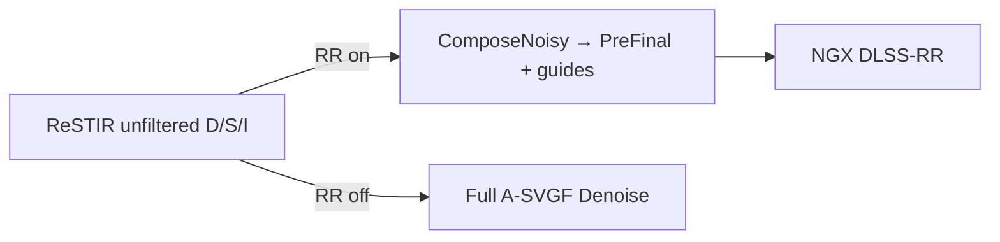

# DLSS Ray Reconstruction noise — investigation log

Living doc for **RR salt / walk noise / unfiltered-direct bleed** on Retribution.  
Not a cheer sheet: record symptoms, failed fixes, working knobs, and next experiments.

**Related:** `AGENTS.md`, `open-issues-rt-lighting.md`, `compat-patches.md`, `material-authoring-spec.md`

**Play path:** `tools/launch-retribution-rt.cmd` → `sourcecode/gzdoom-rt/build/RelWithDebInfo/`  
**RR path in code:** `deps/RTGL` — `ComposeNoisy` (raw unfiltered only) → NGX DLSS-RR (`nvngx_dlssd.dll`)  
`AccumulateForRR` / `rt_rr_temporal` path is **dead** for play — see §4 / §4.1.

---

## 1. Symptom (current)

| | |
|---|---|
| **What** | Salt / grain in the **final** image under native DLSS-RR (`+rt_upscale_dlss 2 +rt_rayreconstr 1`). |
| **Spatial match** | Pattern and locations match Dev debug **Unfiltered diffuse direct** (user did *not* leave that view on — same look when debug is off). |
| **Not** | Emis wall wash / sky leak (mapboost / sky A/B). Not HUD blockiness (Dev Override → Linear/Nearest). |
| **When noticed** | 2026-08-05: RR felt **much noisier** than recent memory; A-SVGF (RR off) looked **stabler** — expected given the pipeline (§2). |
| **Working hypothesis (user)** | Got worse after **full-tree PBR / ORM treatment** (esp. MAP02), but **stripping PBR is not the solution** — keep authored `_n`/`_orm`/`_h` and fix RR/lighting interaction. |

### 1.2 Transient-light ghosting (2026-08-05 ~16:30)

| | |
|---|---|
| **Symptom** | Barrel explosions, muzzle flashes, and other transient bright lights **linger** in the image for ~10 seconds after the source is gone. |
| **Mechanism** | DLSS-RR accumulates temporal history. When a bright event ends, RR's history still contains the lit pixels and slowly fades them out — no mechanism to signal "discard history here." |
| **Why A-SVGF doesn't do this** | A-SVGF's temporal accumulation has anti-firefly + variance-driven history reset. RR's history is ML-driven with no explicit firefly/transient handling. |
| **Guide fixes alone cannot fix this** | Corrected diffuse/specular guides help RR separate lighting from materials, but do not tell RR when to discard stale history. |
| **Required inputs** | NGX supports `pInDisocclusionMask` (write `10000.0` to force history discard) and `pInBiasCurrentColorMask` — see `rr-noise-fix-proposals.md` §5. |
| **Fix path** | Per-frame disocclusion mask: any pixel whose Rec.709 luminance changed by more than a threshold vs the previous frame gets `10000.0`. Simplest first pass: write it from `CmNoisyCompose` comparing current vs `DiffColorHistory` (previous frame's guide). |

---

## 2. Why “non-RR looks stabler” is not a paradox

With DLSS-RR enabled (play default), RTGL does:

```
ReSTIR unfiltered direct/spec/indir
  → ComposeNoisy (raw → PreFinal + RR guides)
  → NGX DLSS-RR
```

and **skips the entire A-SVGF `Denoise()`**, including:

1. Temporal accumulation  
2. Anti-firefly (on *accumulated* buffers)  
3. Variance + spatial atrous  

A-SVGF’s stability under blinking analytic lights mostly comes from **(1)**. RR alone is asked to denoise **1-spp ReSTIR** that hard-cuts when lights blink. Hostile input; ASVGF forgives it; RR does not.

NVIDIA guidance (Streamline / Remix / peer denoisers): need **high-quality noisy inputs** — not broken temporal light animation, and not heavily pre-mangled signals.

---

## 3. Confirmed amplifiers (A/B)

### 3.1 Ceiling inset lamps (analytic direct) — **CONFIRMED**

| | |
|---|---|
| **A/B** | `rt_ceiling_lamps 0` → noise pattern largely **gone**; effect lost. |
| **Mechanism** | Bright shadow-casting spheres (`SFLATAS*` / `SPORT*`, peak was **900**) with **hard on/off** and **dropping the light from the upload list** when dark → ReSTIR + RR history hard-cut every blink. |
| **Shows as** | Unfiltered diffuse direct salt → bleeds into final under RR. |
| **Keep the effect** | Soft fade + dim floor (do **not** delete light): `rt_ceiling_lamp_fade`, `rt_ceiling_lamp_off > 0`, stable `uniqueID` every frame. Same lesson as `rt_mzlflsh_fade`. |
| **Also** | `rt_ceiling_lamp_maxspan` can skip analytics on huge hall sectors (MAP02 mid-ceiling white blink risk). |

### 3.2 Full-tree PBR / ORM (MAP02 especially) — **SUSPECTED, DO NOT NUKE**

| | |
|---|---|
| **What shipped** | 2026-08-04 `ae2846e`: metallic AI demotion + roughness floor across **763** `_orm` maps. Mean metal ~0.13→0.02; dielectric roughness floored ~0.82. |
| **Why it can worsen RR** | Dielectric walls take **full diffuse** (`ro_d = albedo × (1−metallic)`). After demotion, lamp/dynlight ReSTIR variance is louder in the diffuse channel. High-frequency `_n` + ORM still stress RR guides (earlier walk shimmer A/B’d to **roughness G**). |
| **Why stripping PBR is wrong** | Loses CE look and Phase 4 track. Goal is **RR-compatible PBR**, not flat albedos. |
| **Safe A/B (live)** | Dev → Materials A/B: strip normals / ORM / height **separately** — diagnose without deleting overlays. |

### 3.3 Dev Override / sticky persist — **RED HERRING for salt; REAL for blackouts**

Salt itself is not Dev-settings-dependent. Still: keep **Override unchecked**. Sticky `rt/devmode_settings.json` can re-enable Override / temporal / Linear after a session and confuse A/B — wipe or Reset if the image goes weird.

---

## 4. Failed / harmful “fixes” (do not repeat)

| Attempt | Result | Lesson |
|---|---|---|
| ASVGF-style **min/max neighbor clamp** in `CmNoisyCompose` | **No-op** on dense ReSTIR sparkle; also hurt walk stability. | Only helps sparse outliers *after* temporal accum. |
| Remix-style **luminance boiling** (mean×5) + sample max-lum 500 | User: **IQ worse**. | Do not pre-mangle RR’s noise distribution. |
| **`rt_rr_temporal 1`** — A-SVGF temporal → ComposeNoisy → RR | User: **faded duplicate / ghost “depth buffer” view** (`screen/rrasvgghost.png`). | Double reprojection (ASVGF + RR) and/or checkerboard vs regular sampling mismatch (`getCheckerboardPix` vs regular `pix` on DiffTemporary). **Never ship; do not re-wire.** |
| Turning lamps off / nuking PBR | Clears noise; kills feature / look. | A/B only — not ship. |
| `rt_normalmap_stren` / `rt_heightmap_stren` ≫ 1 | Known RR destroyer. | Launcher stays at **1**. |

### 4.1 Black world / only muzzle sprites (2026-08-05 ~14:13) — **FIXED**

Regression after hard-removing `AccumulateForRR` from the RR frame path (ghost fix).

| | |
|---|---|
| **Symptom** | Nearly **black** scene; only firing / weapon **sprites** visible. |
| **Cause** | `CmNoisyCompose` still had a `rrTemporalPrefilterEnabled` branch that sampled **DiffTemporary / SpecAccum / IndirAccum**. Writer (`AccumulateForRR`) was gone → empty buffers → black PreFinal. Raster sprites (muzzle) still drew on top. |
| **Also found** | Dev `ovrd_enable: true` had come back sticky in `rt/devmode_settings.json` (saturation zeros etc.) — always Reset/force Override off after bad sessions. |
| **Fix** | (1) Delete temporal read branch from `CmNoisyCompose.comp` — **always** unfiltered ReSTIR. (2) Force `ovrd_enable: false` + temporal sticky off in Dev JSON. (3) Rebuild `tools/build-rtgl.cmd`. |
| **Do not** | Re-add a ComposeNoisy temporal branch without a matching writer that runs every RR frame, and a checkerboard-correct design. |

---

## 5. Landed mitigations (keep; still incomplete)

| Knob / change | Role |
|---|---|
| `rt_ceiling_lamp_fade` **8** + `rt_ceiling_lamp_off` **0.12** | Soft blink; light stays in ReSTIR list |
| `rt_ceiling_lamp_intensity` **700** | Was 900; dial if salt returns |
| `rt_ceiling_lamp_radius` **0.10** | Slightly softer source |
| Soft muzzle `rt_mzlflsh_fade` | Hard-cut lesson for player flash |
| ORM roughness floor + metal demotion | Walk shimmer; may still interact with lamp salt — **tune**, don’t delete |
| Dev Materials A/B | Live strip N/ORM/H/E without Override |
| `rt_rr_temporal` **0** + ComposeNoisy raw-only | Ghost path disabled; black-world regression fixed |
| Dev Override forced off | After sticky Override caused confusion / blackouts |

**Code touchpoints**

- `deps/RTGL/Source/VulkanDevice.cpp` — RR → `ComposeNoisy` only (no `AccumulateForRR`)
- `deps/RTGL/Source/Denoiser.cpp` — `ComposeNoisy`; `AccumulateForRR` still exists but **unused** on RR path
- `deps/RTGL/Source/Shaders/CmNoisyCompose.comp` — **raw unfiltered only** (no DiffTemporary)
- `sourcecode/gzdoom-rt/.../rt_main.cpp` — ceiling lamps, `rt_rr_temporal`
- Launcher: soft lamp cvars + `+rt_rr_temporal 0`

---

## 6. Pipeline (play default)



Safe stability lever for blink: **soft analytic-light fades**, not ComposeNoisy clamps and not ASVGF-temporal-into-RR.

---

## 7. Next experiments (ordered)

MAP01 spawn + MAP02 dark/key. Prefer Dev Materials A/B over deleting mats.

1. **Lamp energy without kill** — keep fade/off; A/B intensity `400` / `700` / `900` and radius `0.08` / `0.12` / `0.16`.
2. **PBR channel isolation (MAP02)** — strip normals only → ORM only → height only; then targeted authoring, not full PBR rollback.
3. **Guide quality** — motion vectors / linear depth / roughness packing if walk-only salt remains after soft lamps.
4. **Sensitivity** — `rt_illum_sens_direct` A/B.
5. **Do not** re-enable `rt_rr_temporal` / ComposeNoisy temporal reads — ghost + black-world hazards.
6. **Optional later** — RTXDI reservoir boiling *inside* ReSTIR (not ComposeNoisy).

**Out of scope / don’t**

- Delete Retribution-RT-Materials PBR as the “fix”
- Re-enable boiling / min-max / temporal-into-RR without a new theory + A/B
- Leave Dev **Override** checked across sessions
- Raise normal/height strength above ~1

---

## 8. Quick console cheat sheet

```
rt_ceiling_lamps 0          // A/B: salt from analytic ceiling lights?
rt_ceiling_lamps 1
rt_ceiling_lamp_intensity 400
rt_ceiling_lamp_off 0.12
rt_ceiling_lamp_fade 8
rt_rr_temporal 0            // REQUIRED (ghost if 1; black if Compose reads empty temporal)
rt_rayreconstr 0            // full A-SVGF reference (world returns → RR/compose path)
rt_dynlight 0               // split dynlights vs ceiling lamps
```

Dev: Materials A/B → strip N/ORM/H; keep **Override** off; leave **RR temporal prefilter** off (UI may still exist; Compose ignores it).

---

## 9. Status (2026-08-05 ~16:30)

| Item | State |
|---|---|
| Debug channel = unfiltered direct | Confirmed |
| Ceiling lamps amplify | Confirmed |
| Soft lamp fade | **Landed** (best current lever for lamp salt) |
| Screen-space boiling / min-max | **Failed** — IQ worse |
| A-SVGF temporal before RR | **Failed** — ghost; call removed; ComposeNoisy temporal branch **deleted** |
| Black world / muzzle-only | **Fixed** — empty DiffTemporary after writer removal (§4.1) |
| Dev Override sticky | Forced **off** in `devmode_settings.json` (again after blackout) |
| Full-tree PBR as regression driver | **Suspected**; do not strip overlays |
| DLL version | **310.7.0 (latest)** |
| **pInSpecularHitDistance = nullptr** | **Landed** — was FB_DEPTH_WORLD |
| **Corrected RR guides (diffuse + specular)** | **Landed** — diffuse to DiffColorHistory, spec = envBRDFApprox2×mod; sky=(0.5,0.5,0.5) |
| **Transient-light ghosting (barrel/muzzle linger)** | **P0 blocker — zero improvement from guide fixes.** RR history retains bright flashes for ~10s after source is gone. Guide corrections do not address this at all. Needs `pInDisocclusionMask`. See §1.2. |
| **Guide fixes + null hitDistance: net effect** | **No visible improvement.** Salt still present; ghosting from transients dominates any guide-correction benefit. Guide fixes are necessary but not sufficient — RR needs explicit history-management signals (disocclusion, biasCurrentColor, responsivity) to be usable. |
| Muzzle flash weakness | Reported; likely from guide modulation or specularHitDistance removal; investigate after ghosting fix |
| Exposure/emission baked into RR input | **Open** — pipeline reorder deferred |
| ReSTIR decorrelation | **Open** |
| Transparency layer | **Open** |

**Changes this session (`deps/RTGL`):**
- `Source/DLSSRR.cpp:397`: `pInSpecularHitDistance = nullptr` (was FB_DEPTH_WORLD)
- `Source/DLSSRR.cpp:330-336,358`: diffuse-albedo binding moved to `FB_DIFF_COLOR_HISTORY`
- `Source/Shaders/BRDF.h`: added `envBRDFApprox2()` (GGX preintegrated; coefficients from RR guide §3.4.2)
- `Source/Shaders/CmNoisyCompose.comp`: rewrote guide staging — diffuse=ro_d×mod→DiffColorHistory, spec=envBRDF×mod→DiffPong, sky=(0.5,0.5,0.5); reads ViewDirection for NoV
- `Source/Denoiser.cpp`: added `FB_DIFF_COLOR_HISTORY` + `FB_VIEW_DIRECTION` to ComposeNoisy barriers

**Next priority:** disocclusion mask (`pInDisocclusionMask`) to fix barrel/muzzle linger (§1.2). Without this, RR is unusable for gameplay — any transient light sticks for seconds. Guide fixes alone are insufficient; RR needs explicit signals to discard stale history.
